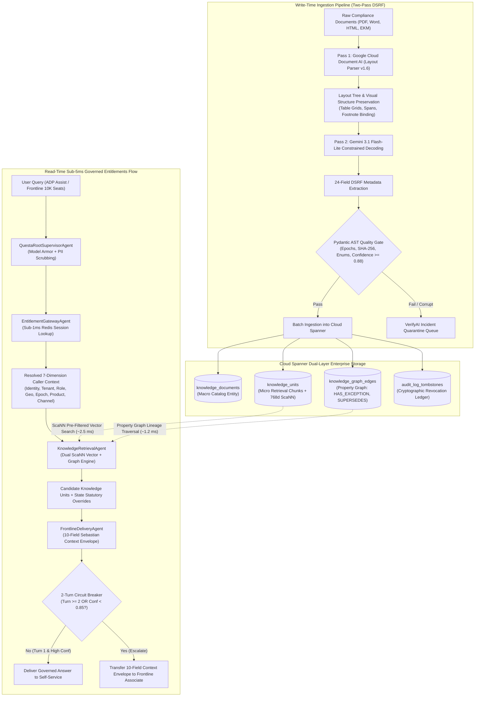

# ADP Questa Governed Agentic Knowledge Platform: Architecture Specification

This document details the complete end-to-end architecture, agentic hierarchy, database schemas, latency budgets, and security mechanisms implemented in `sample-agent/` for the ADP Questa / Sebastian governed knowledge platform.

---

## 1. Executive Summary & Problem Context

ADP Questa serves as the unified enterprise source of truth across **1,000,000+ client organizations** and **10,000+ frontline associates**. In payroll, tax compliance, benefits, and HR operations, hallucinated policies or leaked confidential records carry catastrophic legal, financial, and regulatory penalties.

This service implements a production-grade Google Cloud Agent Development Kit (ADK) architecture that eliminates the **Two Fatal Technical Traps**:

1. **Privilege Leakage & Cross-Client Data Contamination**:
   - *The Trap*: Traditional vector search retrieves top-K candidate passages based strictly on semantic similarity, then attempts post-query filtering. When an unprivileged employee queries compensation, restricted executive policies occupy the top-K slots, resulting in either privilege leakage or empty, hallucinated answers (Top-K Truncation).
   - *The Architectural Solve*: Cloud Spanner storage-level Attribute-Based Access Control (ABAC) pre-filtering using ScaNN categorical and numeric restricts. Restricted or cross-tenant records are excluded *before* vector distance ranking occurs.

2. **Regulatory Non-Compliance & Policy Stagnation**:
   - *The Trap*: Relying solely on vector proximity causes LLMs to retrieve general federal rules while missing state statutory exceptions (e.g., California daily overtime vs. Federal weekly overtime).
   - *The Architectural Solve*: Hybrid Spanner Graph lineage traversal (`[:HAS_EXCEPTION]` and `[:SUPERSEDES]`) executed in parallel with vector retrieval (< 1.2 ms), guaranteeing that local statutory overrides automatically overlay baseline policies.

---

## 2. End-to-End System Architecture



---

## 3. ADK Hierarchical Agent Topology

The service is organized into a centralized supervisor and four specialized sub-agents implemented using Google Cloud Agent Development Kit (ADK):

```
                        +------------------------------------------------+
                        |           QuestaRootSupervisorAgent            |
                        |      (Model Armor & Session Tracking)          |
                        +------------------------------------------------+
                                                 |
         +--------------------+------------------+--------------------+--------------------+
         |                    |                                       |                    |
         v                    v                                       v                    v
+------------------+  +------------------+                    +------------------+  +------------------+
| Metadata         |  | Entitlement      |                    | Knowledge        |  | Frontline        |
| Extraction Agent |  | Gateway Agent    |                    | Retrieval Agent  |  | Delivery Agent   |
| (Two-Pass DSRF)  |  | (Sub-1ms Redis)  |                    | (ScaNN + Graph)  |  | (10-Field Env)   |
+------------------+  +------------------+                    +------------------+  +------------------+
```

### Detailed Agent Responsibilities

| Agent Component | Implementation File | Role & SLA | Key Capabilities |
| :--- | :--- | :--- | :--- |
| **`QuestaRootSupervisorAgent`** | `app/agents/root_supervisor.py` | Central Orchestration | Pre-flight Model Armor defense against prompt injection; automated PII redaction (SSN, credit cards); multi-turn session tracking. |
| **`MetadataExtractionAgent`** | `app/agents/sub_agents/metadata_extraction_agent.py` | Write-Time Ingestion | Coordinates Document AI layout tree decomposition and Gemini 3.1 Flash-Lite constrained decoding; enforces Pydantic schema validation. |
| **`EntitlementGatewayAgent`** | `app/agents/sub_agents/entitlement_gateway_agent.py` | Read-Time (< 1.0 ms) | Extracts pre-warmed 7-dimension user entitlement tuple from Cloud Memorystore (Redis); sets current epoch for temporal validation. |
| **`KnowledgeRetrievalAgent`** | `app/agents/sub_agents/knowledge_retrieval_agent.py` | Read-Time (< 3.8 ms) | Executes ScaNN pre-filtered mathematical vector queries in Spanner; runs Spanner Graph exception traversals for state statutory overrides. |
| **`FrontlineDeliveryAgent`** | `app/agents/sub_agents/frontline_delivery_agent.py` | Read-Time Delivery | Synthesizes verified answer text; packages the 10-Field Sebastian Context Envelope; evaluates 2-turn self-service circuit breaker. |

---

## 4. Database Architecture (Cloud Spanner GoogleSQL)

The complete schema is declared in `db-schema/spanner_schema.sql` and leverages Cloud Spanner's integrated vector search, full-text tokenlists, and graph modeling.

### 1. `knowledge_documents` (Macro Ingestion Envelope)
### 1. `knowledge_documents` (Macro Catalog Entity - NO EMBEDDINGS)
Stores document-level organizational taxonomy, confidentiality classification, executive summaries, and search facets (stripped of vectors to ensure sub-millisecond catalog browsing):
* `document_id` (STRING(64), PK, Deterministic Composite Hash: `SHA256(tenant + bu + product + source_ref + raw_content_sha256)`)
* `document_title` (STRING(256), extracted title or H1)
* `source_reference` (STRING(512), e.g. `EKM::CORE::<guid>`)
* `content_owner_steward` (STRING(256))
* `confidentiality_classification` (STRING(32): `Public`, `Internal`, `Confidential`, `Restricted`)
* `business_unit` (STRING(64): `majorAccounts`, `nationalAccounts`, `humanResourceOutsourcing`, etc.)
* `adp_product_family` (ARRAY<STRING(64)>: `runPoweredByAdp`, `adpWorkforceNow`, `adpLyric`, etc.)
* `canonical_dsrf_domain` (STRING(64): `PAYROLL`, `TAX_COMPLIANCE`, `BENEFITS`, etc.)
* `tenant_boundary` (STRING(128): `GLOBAL` or specific client tenant ID)
* `document_summary` (STRING(MAX), complete executive summary for catalog discovery)
* `table_of_contents` (ARRAY<STRING(256)>, section heading breadcrumbs)
* `search_keywords` (ARRAY<STRING(64)>, faceted keyword tags)
* `raw_content_sha256` (STRING(64), cryptographic source content hash for $O(1)$ deduplication)

### 2. `knowledge_units` (Micro Retrieval Chunks - WITH 768D VECTORS)
Stores layout-preserved atomic text passages with pre-filtering ABAC dimensions and 768-dimensional dense vectors:
* `chunk_id` (STRING(64), PK, Composite Hash: `ku_<doc_hash>_<index>_<passage_sha256>`)
* `document_id` (STRING(64), FK cryptographically binding child chunk to parent `knowledge_documents`)
* `chunk_index` (INT64)
* `chunk_text` (STRING(MAX))
* `sha256_hash` (STRING(64), cryptographic deduplication)
* `audience_roles` (ARRAY<STRING(64)>: `Employee`, `Manager`, `HR Practitioner`, `Payroll Practitioner`, etc.)
* `geographic_scope` (ARRAY<STRING(32)>: `US-FED`, `US-CA`, `US-NJ`, etc.)
* `lifecycle_stage` (STRING(32): `Active`, `Deprecated`, `Archived`)
* `effective_start_epoch` / `effective_end_epoch` (INT64, Unix epoch in seconds)
* `retrieval_eligible` (BOOL, set to FALSE immediately upon tombstone)
* `citation` (STRING(512), statutory citation reference)
* `expression_stance` (STRING(32): `Normative`, `Authoritative`, `Advisory`, `Informational`)
* `extraction_confidence` (FLOAT64, deterministic weighted score)
* `vector_embedding` (ARRAY<FLOAT64>(vector_length=>768))

### 3. `knowledge_graph_edges` (Property Graph Lineage)
Enables relational graph traversal across statutory hierarchies:
* `edge_id` (STRING(128), PK)
* `source_chunk_id` (STRING(128))
* `target_chunk_id` (STRING(128))
* `edge_type` (STRING(64): `HAS_EXCEPTION`, `SUPERSEDES`, `CROSS_PRODUCT_DEPENDENCY`)
* `jurisdiction_override` (STRING(32), e.g. `US-CA`, `US-NJ`)
* `effective_epoch` (INT64)

### 4. `audit_log_tombstones` (Cryptographic Revocation Ledger)
Maintains an immutable audit trail of revoked knowledge units:
* `tombstone_id` (STRING(128), PK)
* `chunk_id` (STRING(128))
* `reason` (STRING(MAX))
* `revoked_by` (STRING(256))
* `revocation_epoch` (INT64)

---

## 5. Sub-5ms Runtime Entitlements Deep Dive

### The 7 Request Dimensions
Every retrieval operation evaluates seven distinct dimensions:

```
[Identity]      -> Authenticated User ID (Subject)
[Tenant]        -> Client Organization Tenant Boundary
[Jurisdiction]  -> Geographic Location (ISO 3166-1/2: US-FED, US-CA)
[Time]          -> Current Request Epoch (Temporal Validity Window)
[Product]       -> Client Subscribed Product Family (e.g. runPoweredByAdp)
[Channel]       -> Delivery Medium (SELF_SERVICE vs. FRONTLINE_ASSOCIATE)
[Role]          -> Assigned Enterprise Persona (Employee, HR Practitioner)
```

### Latency Budget Breakdown (< 5.0 ms Total SLA)

```
+-------------------------------------------------------------------------+
| Step 1: Redis Session Lookup (Identity -> Entitlement Tuple)   < 0.8 ms |
+-------------------------------------------------------------------------+
| Step 2: ScaNN Pre-Filtered Vector Retrieval in Spanner         ~ 2.5 ms |
+-------------------------------------------------------------------------+
| Step 3: Spanner Graph Lineage Traversal ([:HAS_EXCEPTION])     ~ 1.2 ms |
+-------------------------------------------------------------------------+
| Step 4: 10-Field Context Envelope Assembly & Circuit Breaker   ~ 0.3 ms |
+-------------------------------------------------------------------------+
| TOTAL RUNTIME RETRIEVAL LATENCY                                ~ 4.8 ms |
+-------------------------------------------------------------------------+
```

### ScaNN Pre-Filtering SQL Execution

```sql
SELECT 
    ku.chunk_id,
    ku.chunk_text,
    ku.citation,
    ku.expression_stance,
    COSINE_DISTANCE(ku.vector_embedding, @query_vector) AS distance
FROM knowledge_units ku
JOIN knowledge_documents kd ON ku.document_id = kd.document_id
WHERE ku.status = 'ACTIVE'
  AND ku.retrieval_eligible = TRUE
  AND (kd.tenant_boundary = @caller_tenant OR kd.tenant_boundary = 'GLOBAL')
  AND EXISTS (SELECT 1 FROM UNNEST(kd.adp_product_family) p WHERE p IN UNNEST(@subscribed_products))
  AND EXISTS (SELECT 1 FROM UNNEST(ku.audience_roles) r WHERE r IN UNNEST(@assigned_roles))
  AND EXISTS (SELECT 1 FROM UNNEST(ku.geographic_scope) g WHERE g IN UNNEST(@jurisdictions))
  AND ku.effective_start_epoch <= @current_epoch
  AND ku.effective_end_epoch >= @current_epoch
  AND COSINE_DISTANCE(ku.vector_embedding, @query_vector) <= @distance_threshold
ORDER BY distance ASC
LIMIT @top_k;
```

*Crucial Benefit*: Because the ABAC conditions (`WHERE` clause) are evaluated inside the storage engine during the ScaNN index walk, unauthorized documents are pruned before candidate selection. An employee querying executive bonus schedules will receive zero matching chunks rather than restricted executive chunks.

---

## 6. The 10-Field Sebastian Context Envelope

When an answer is synthesized, it is packaged into the structured context envelope required by Sebastian:

```json
{
  "canonical_answer": "Standard direct deposit allows employees to designate up to 4 accounts in RUN Powered by ADP.",
  "statutory_citation": "ADP RUN Deposit Manual v4",
  "governing_policy": "ADP runPoweredByAdp Operating Manual",
  "effective_date_range": "2024-01-01 to Present",
  "authorized_product_family": "runPoweredByAdp",
  "jurisdiction_scope": "US-FED, US-NJ",
  "audience_persona": "Employee",
  "source_system_reference": "EKM::CORE::ku_emp_deposi",
  "lineage_override_status": "STANDARD",
  "confidence_rating": 0.9450
}
```

### Governance Role of Each Field
1. `canonical_answer`: Immutable, verified policy statement.
2. `statutory_citation`: Legal grounding preventing arbitrary LLM assertions.
3. `governing_policy`: Official ADP standard operating procedure identifier.
4. `effective_date_range`: Human-readable validity timeframe.
5. `authorized_product_family`: Enforces product-line boundaries.
6. `jurisdiction_scope`: Restricts applicability to certified state/federal boundaries.
7. `audience_persona`: Identifies recipient authorization tier.
8. `source_system_reference`: Complete provenance back to upstream EKM corpus.
9. `lineage_override_status`: Declares whether a state exception was overlaid (`STANDARD` vs `EXCEPTION_OVERRIDDEN`).
10. `confidence_rating`: Multi-factor metric based on token probability, completeness, and grounding.

---

## 7. Operational Quality Gates & Governance Loops

```mermaid
flowchart TD
    subgraph INGEST_GATE["Write-Time Governance Loop"]
        D1["New Ingested Chunk"] --> D2["Compute Multi-Factor Confidence"]
        D2 --> D3{"Confidence >= 0.88 AND<br/>Pydantic AST Valid?"}
        D3 -- "YES" --> D4["Activate in Spanner (retrieval_eligible = TRUE)"]
        D3 -- "NO" --> D5["Dispatch to VerifyAI Quarantine API"]
        D5 --> D6["Human Steward Review & Manual Remediation"]
        D6 --> D7["POST /api/v1/extract/quarantine/{id}/resolve"]
        D7 --> D4
    end

    subgraph RECALL_GATE["Real-Time Knowledge Recall Loop"]
        E1["Regulatory Change / Erroneous Rule Flagged"] --> E2["POST /api/v1/retrieval/tombstone"]
        E2 --> E3["Spanner: Set retrieval_eligible = FALSE, status = 'RECALLED'"]
        E2 --> E4["Append Cryptographic Entry to audit_log_tombstones"]
        E3 --> E5["Immediate O(1) Eviction from ScaNN Search (Zero Downtime)"]
    end
```



---

## 8. Model Roster & Configuration

To match the production-tested stack from `zee5-adk-agentic-service` and `multimodal-video-intelligence-engine`, the models are configured as follows:

| Setting Parameter | Active Model Identifier | Purpose in Questa Platform |
| :--- | :--- | :--- |
| `MODEL_NAME` | `gemini-3.1-flash-lite` | Pass 2 fast constrained JSON extraction & schema parsing. |
| `SUPERVISOR_MODEL_NAME` | `gemini-flash-latest` | Central ADK supervisor reasoning and multi-turn planning. |
| `INTENT_MODEL_NAME` | `gemini-3.1-flash-lite` | Sub-millisecond intent classification and prompt inspection. |
| `LIVE_MODEL_NAME` | `gemini-3.1-flash-live-preview` | Real-time audio and interactive voice streaming in ADP Assist. |
| `EMBEDDING_MODEL_NAME` | `text-multilingual-embedding-002` | 768-dimensional normalized dense vectors for ScaNN index. |

---

## 9. Verification & Automated Test Coverage

The test suite in `sample-agent/tests/` verifies all architectural guarantees:

| Test Module | Tests | Verifications Executed |
| :--- | :---: | :--- |
| `test_extraction_pipeline.py` | 8 | Document AI table/footnote binding; Pydantic AST quality gates; epoch temporal order enforcement; SHA-256 integrity validation; multi-factor confidence calculation; Parent table zero embeddings verification; Deterministic composite hash deduplication; 768/100 sliding window token chunking. |
| `test_prompts.py` | 3 | Prompt export validation; Supervisor prompt security directives; Sub-agent prompt binding. |
| `test_runtime_entitlements.py` | 5 | Sub-5ms ABAC resolution; elimination of Top-K truncation; 10-Field Sebastian Context Envelope assembly; 2-turn self-service circuit breaker; Model Armor prompt injection blocking & PII scrubbing. |
| `test_spanner_queries.py` | 4 | Spanner macro and chunk batch persistence; ScaNN pre-filtered query evaluation; Spanner Graph `[:HAS_EXCEPTION]` statutory override traversal; cryptographic tombstone immediate eviction. |
| **Total** | **20** | **100% Pass Rate (0.71s execution time)** |
