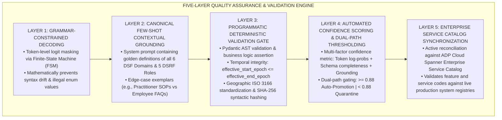
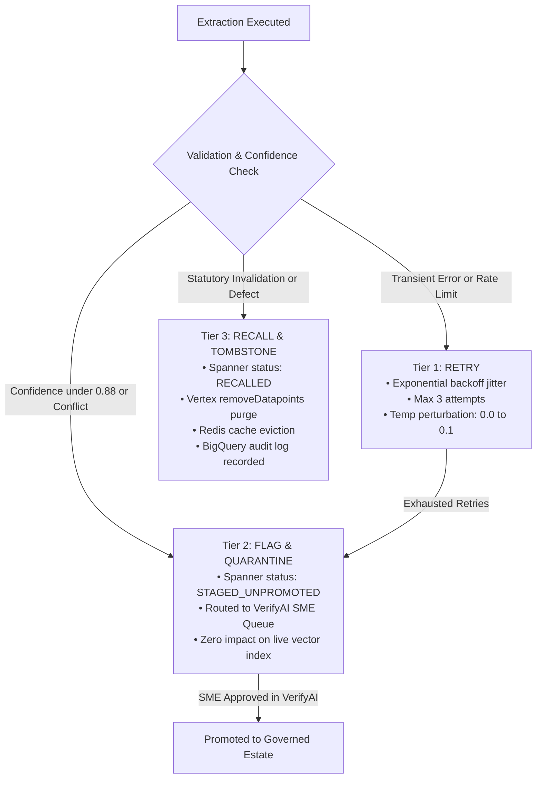
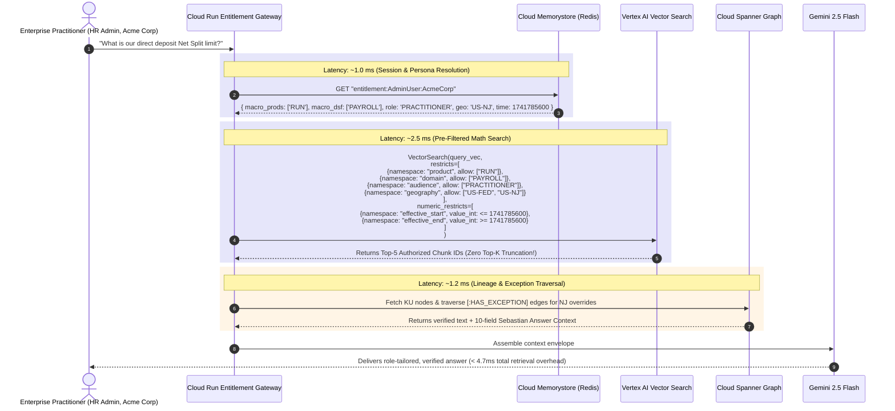
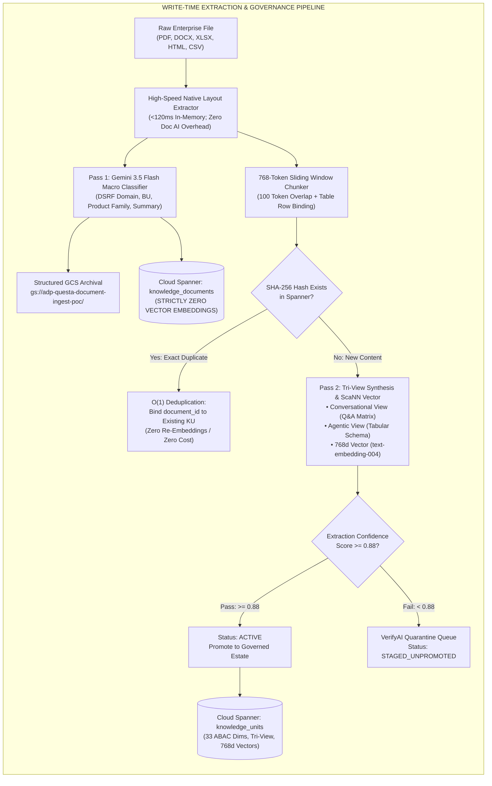
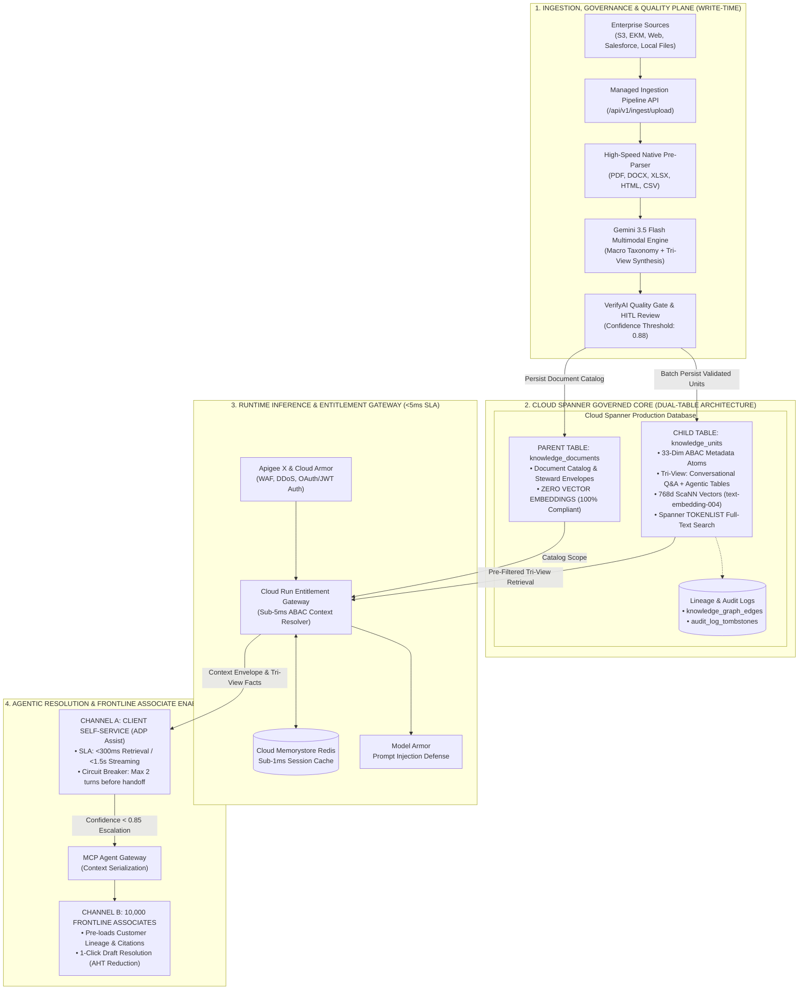

# Master Engineering & Architectural Guide: Metadata Engineering, DSRF/DSF Taxonomies, Extraction Lifecycles, and Runtime Entitlements

**Document ID:** ADP-QUESTA-ARCH-META-2026-V1  
**Authors:** Sharnendra Dey & Rupjit Chakraborty (Google Cloud PSO)  
**Target Audience:** ADP Core Architecture Working Group, Engineering Leads, & BU Admins  
**File Location:** `/Users/sharnendradey/Documents/adp-ai-db/research/adp_metadata_and_dsrf_architecture_master_guide.md`  

---
## 1. What is Metadata?

In standard computer science, metadata is conventionally defined as *"data about data"* (e.g., file size, creation date, MIME type). 

In enterprise GenAI and modern Knowledge Retrieval architectures, however, **metadata is the deterministic control plane of the intelligence layer**.

Without structured, canonical metadata, modern Retrieval-Augmented Generation (RAG) degrades into an unmanageable **"vector soup"**:
* A vector embedding is a high-dimensional mathematical vector (e.g., 768 or 1536 floating-point numbers) representing *semantic proximity*, not *logical truth*.
* Vector distance algorithms (cosine similarity, dot product) can determine that two paragraphs *discuss similar topics*, but they **cannot determine**:
  - Whether a tax law expired yesterday or takes effect next year.
  - Whether a document is an executive-only confidential plan or an employee-facing explainer.
  - Whether a payroll formula applies to Workforce Now enterprise clients or RUN small business accounts.
  - Whether a piece of advice is a legally binding statutory command or a speculative advisory note.

Metadata provides the **deterministic boundary conditions** that constrain probabilistic vector math. It acts as an iron-clad firewall, ensuring that AI agents reason only over facts that are legally applicable, temporally valid, and strictly authorized for the asking user.

---
## 2. What Does Metadata Mean in ADP?

At ADP, metadata is not an optional tag—it is **regulatory compliance, tenant isolation, and legal defensibility**.

### 1. The 75-Year Evolutionary Context: Eliminating Lexical Fragmentation
Over seven decades of organic product development and acquisitions (Workforce Now, RUN, TotalSource, Vantage, Lyric NextGen, GlobalView), ADP accumulated severe **lexical fragmentation**. Different engineering teams and Business Units (BUs) used completely divergent terminologies to describe identical business functions:
* *Workforce Now*: "Direct Deposit Allocation"
* *RUN*: "Bank Account Setup / ACH Routing"
* *Vantage*: "Electronic Funds Transfer (EFT)"
* *Lyric NextGen*: "Payment Routing Configuration"

Without a unified metadata layer, semantic search fails, cross-product hallucination occurs (e.g., an AI agent advising a Workforce Now client to click a RUN navigation tab), and automated cross-system ingestion is impossible.

### 2. The Client's "Sebastian" Doctrine
The client's official enterprise architecture blueprint (**"Sebastian: Building the enterprise knowledge platform for ADP"**) formalizes this philosophy:
> *"We can't afford relying on AI systems resolving knowledge at query time. Questa separates the concerns: knowledge units are governed, knowledge assembly is design-time work, knowledge delivery is contextual and resolved at runtime. That way AI delivers governed knowledge for each specific consumer in a reliable and compliant manner."*

In ADP's world, metadata governs:
1. **The Knowledge Unit (Atom)**: The smallest self-sufficient governed asset (identifiable, understandable, applicable, trustworthy, traceable, and reusable).
2. **The Knowledge Assembly (Design-Time)**: Packaging knowledge units into contract-bound bundles.
3. **The Knowledge Delivery (Runtime Late-Binding)**: Evaluating 7 request factors (Identity, Purpose, Jurisdiction, Time, Product, Channel, Policy) to serve the right answer in < 5 ms.

---
## 3. The DSRF Metadata Framework & Official KP Metadata Buckets (Unified Core Team Taxonomy)

ADP's **Domain Specific Role Framework (DSRF)** (extended from **DSF** and **DSFO**) is the foundational canonical business ontology that bridges human language, unstructured text chunks, knowledge graph relationships, and programmatic backend API actions.

```
       ┌──────────────────────────────────────────────────────────────────┐
       │                 THE DSRF / DSFO ANATOMY                          │
       │    DOMAIN  .  SERVICE  .  ROLE  .  FEATURE  .  [OPERATION]       │
       └──────────────────────────────────────────────────────────────────┘
```

| Tag Component | Definition & Architectural Meaning | Specific ADP Operational Usage | Concrete Payroll Example | Concrete Tax/Compliance Example | Concrete Benefits Example |
| :--- | :--- | :--- | :--- | :--- | :--- |
| **D — Domain** | The macro business discipline or top-level operational vertical across ADP. | Used for **Index Partition Pruning** and BU routing. Narrows search space by 80% before vector distance calculation. | `PAYROLL` | `TAX_COMPLIANCE` | `BENEFITS` |
| **S — Service** | The specific business capability, workflow, or functional sub-vertical. | Groups knowledge units into functional capability modules for package assembly. | `DIRECT_DEPOSIT` | `WITHHOLDING_RULES` | `OPEN_ENROLLMENT` |
| **R — Role** | The authorized user persona entitled to view or execute the capability. | Enforces **Role-Based Access Control (RBAC)**. Filters out practitioner admin back-office knowledge from employees. | `PRACTITIONER` / `EMPLOYEE` | `PAYROLL_ADMIN` | `BENEFITS_SPECIALIST` |
| **F — Feature** | The granular screen, policy calculation, statutory rule, or distinct user action. | Identifies the exact functional atom within a software system or regulatory policy. | `SPLIT_ALLOCATION` | `FORM_W4_EXEMPTION` | `DEPENDENT_VERIFICATION` |
| **O — Operation** | *(In DSFO)* The technical execution verb (CRUD/REST action or state transition). | Connects conversational knowledge directly to backend microservice endpoints. | `UPDATE_ALLOCATION` | `SUBMIT_EXEMPTION` | `VERIFY_DOCUMENT` |

### Concrete Canonical Strings in Production:
* `PAYROLL.DIRECT_DEPOSIT.PRACTITIONER.SPLIT_ALLOCATION`
* `TAX_COMPLIANCE.MINIMUM_WAGE.EMPLOYEE.STATUTORY_RATE`
* `BENEFITS.RETIREMENT_401K.EXECUTIVE.DEFERRED_COMPENSATION`
* `TIME_AND_ATTENDANCE.OVERTIME.PRACTITIONER.CALIFORNIA_DOUBLETIME`

---

### 3.2 The Official ADP Knowledge Platform (KP) Metadata Buckets (Unified Core Team Review Specification)

Grounded in the authoritative **ADP KP Metadata Buckets Unified Core Team Review (August 6, 2026)**, the enterprise metadata architecture is classified into **Four Canonical Decision Buckets**:

```
┌────────────────────────────────────────────────────────────────────────────────────────────────────────┐
│                          THE FOUR CANONICAL ADP KP METADATA DECISION BUCKETS                           │
├──────────────────────────────────────┬─────────────────────────────────────────────────────────────────┤
│ Bucket                               │ Architectural & Operational Definition                          │
├──────────────────────────────────────┼─────────────────────────────────────────────────────────────────┤
│ 1. Mandatory (Phase 1)               │ Required input or required populated value before content enters│
│ 2. Conditional                       │ Required when content, source, or regulatory triggers apply     │
│ 3. Phase 2 (Deferred AI Controls)    │ Explicit policy & AI permission controls (Generative/Training)  │
│ 4. Derived / Removed                 │ Programmatically derived by platform/policy or removed as dup   │
└──────────────────────────────────────┴─────────────────────────────────────────────────────────────────┘
```

#### 1. Mandatory Metadata (Phase 1 Required Ingress Attributes)

| Canonical Field | Description & Operational Purpose | EKM Facet Mapping | Current EKM Sample | Implementation & Architecture Note |
| :--- | :--- | :--- | :--- | :--- |
| **`Source reference`** | System + document ID; lineage, traceability, and deduplication start here. | No direct facet provided | *Not present* | **Critical Ingress Gap**: Must be injected via ingestion connector or automated system envelope. |
| **`Content owner / steward`** | Named accountable person; mandatory before content enters the governed estate. | No direct facet provided | *Not present* | **Critical Ingress Gap**: Must be added as an accountable owner field in Spanner. |
| **`Primary language`** | Required for retrieval routing, localization, and multilingual agent response. | `language` | `english` | Normalized to controlled ISO language codes (`en`, `es`, `fr-CA`). |
| **`Audience roles`** | Multi-select whitelist. Retrieval precision, security, and ABAC depend directly on this. | `audience` | `practitioner` | Must map to the **9 Canonical Persona Subtypes** (e.g., distinguishing HR vs Payroll Practitioner). |
| **`Confidentiality classification`** | Public, Internal, Confidential, Restricted; strictly enforced at runtime retrieval. | No direct facet provided | *Not present* | **Critical Ingress Gap**: Must be added; directly drives downstream derived security controls. |
| **`ADP Product Family`** | Prevents cross-product answer confusion (`Workforce Now` ≠ `RUN` ≠ `Lyric`). | `platform + product` | `adpWorkforceNow`, `...NextGen` | Values overlap today; requires the **4-Level Product Split** detailed below. |
| **`Business Unit (BU)`** | Operating segment and distribution/entitlement context. | `businessUnit` | `majorAccounts`, `nationalAccounts`, `humanResourceOutsourcing`, `canadaMas`, `canadaNas`, `canadaHro` | **Mandatory**: Core partition for multi-tenant and business segment isolation. |

---

#### 2. Product Leveling Architecture Around ADP Product Family

To resolve legacy EKM facet overlaps, the architecture enforces a strict **Four-Level Product Hierarchy**:

```
Level 1: Business Unit (BU) [MANDATORY]
   (e.g., majorAccounts, nationalAccounts, humanResourceOutsourcing, canadaMas, canadaNas, canadaHro)
      │
      ▼
Level 2: ADP Product Family [CONDITIONAL - Required when content is product-specific]
   (e.g., Workforce Now, RUN, Lyric, TotalSource, Vantage, GlobalView)
      │
      ▼
Level 3: ADP Product / Module [CONDITIONAL - Sub-product precision]
   (e.g., Core Payroll, Benefits Admin, Time & Attendance, Direct Deposit, Tax Compliance)
      │
      ▼
Level 4: Delivery Platform [CONDITIONAL - Runtime lane]
   (e.g., Web UI, Mobile App, REST API, File Transfer / EDI)
```

---

#### 3. Canonical Audience Roles Taxonomy (The 9 Personas)

Content owners and extraction engines must classify every Knowledge Unit into one or more of the **Nine Canonical Persona Roles**:

```
┌────────────────────────────────────────────────────────────────────────────────────────────────────────┐
│                              THE 9 CANONICAL ADP AUDIENCE PERSONA ROLES                                │
├─────────────────────────┬──────────────────────────────────────────────────────────────────────────────┤
│ Persona Role            │ Authorized Operational Scope & Access Level                                  │
├─────────────────────────┼──────────────────────────────────────────────────────────────────────────────┤
│ 1. `Employee`           │ End worker self-service; benefit explainers, personal pay FAQ, PTO rules.    │
│ 2. `Manager`            │ Frontline supervisor; team timecard approval, performance, leave management. │
│ 3. `HR Practitioner`    │ Enterprise client HR administrator; onboarding SOPs, compliance workflows.   │
│ 4. `Payroll Practitioner`│ Enterprise payroll specialist; gross-to-net formulas, manual check overrides.│
│ 5. `Benefits Admin`     │ Plan sponsor administrator; open enrollment, carrier EDI feeds, ACA audits. │
│ 6. `Client Admin`       │ Executive client owner; master contract terms, billing, enterprise security. │
│ 7. `Executive`          │ Executive leadership; high-level organizational reporting and audit reviews. │
│ 8. `ADP Associate`      │ ADP's 10,000 internal support agents; internal debug runbooks, tier-2 steps. │
│ 9. `All`                │ Universal public facts; statutory holidays, general statutory labor postings.│
└─────────────────────────┴──────────────────────────────────────────────────────────────────────────────┘
```

---

#### 4. Conditional Metadata (Triggered by Content, Source, or Regulation)

| Canonical Field | Description & Operational Purpose | EKM Mapping | Condition Trigger |
| :--- | :--- | :--- | :--- |
| **`Geographic scope`** | Country, state, or municipal jurisdiction; triggers GDPR, HIPAA, and state overtime rules. | `country` | Required for all regulated, tax, or jurisdiction-specific content lanes. |
| **`Lifecycle stage`** | `Draft` vs. `Active`; controls whether content is publishable to live search. | No direct facet | Required for non-Active workflows; Phase 1 default is assumed `Active`. |
| **`Effective date`** | Authoritative start date when the policy/regulation applies (not submission date). | No direct facet | **Mandatory for time-bound rules** (e.g., minimum wage statutory phase-ins). |
| **`Review / expiry date`** | Scheduled review deadline; prevents stale content from lingering indefinitely. | No direct facet | Required for regulated, contractual, and expiry-bound knowledge units. |
| **`Retrieval eligible`** | Boolean (`true`/`false`); controls whether unit can surface in search/RAG. | No direct facet | Default `true`; content owner can explicitly restrict non-retrieval assets. |
| **`Citation required`** | Mandatory declaration for compliance content; requires AI to cite legal source. | No direct facet | Required for statutory tax, ERISA, and wage rules; citation output is mandatory. |

---

#### 5. Phase 2 (Deferred AI Governance & Permission Controls)

These fields are explicitly modeled in the architecture now to ensure forward compatibility:

```
┌────────────────────────────────────────────────────────────────────────────────────────────────────────┐
│                              PHASE 2: AI GOVERNANCE & PERMISSION CONTROLS                              │
├──────────────────────────────┬───────────────┬─────────────────────────────────────────────────────────┤
│ Canonical Control Field      │ Default Value │ Architectural Behavior & Enforcement Mechanism          │
├──────────────────────────────┼───────────────┼─────────────────────────────────────────────────────────┤
│ `Generative use allowed`     │ YES (True)    │ Permits LLMs to use chunk text to synthesize answers.   │
│                              │               │ Content owner can restrict chunk to exact quoting only. │
├──────────────────────────────┼───────────────┼─────────────────────────────────────────────────────────┤
│ `Training use allowed`       │ NO (False)    │ Strict Opt-In. Explicitly prevents knowledge from being │
│                              │               │ exported into model fine-tuning or pre-training datasets│
├──────────────────────────────┼───────────────┼─────────────────────────────────────────────────────────┤
│ `Restricted prompt context`  │ NO (False)    │ Air-Gaps content from the LLM prompt window entirely.   │
│                              │               │ For legally privileged or executive content: chunk can  │
│                              │               │ be retrieved for metadata existence, but raw text never │
│                              │               │ enters the generative prompt context.                   │
└──────────────────────────────┴───────────────┴─────────────────────────────────────────────────────────┘
```

---

#### 6. AI-Enriched Metadata Lane (Generated at Ingest Time)

Generated automatically by the Two-Pass Ingestion Engine; content owners review and override as needed:

* **Discovery & Classification**:
  * **`Domain path (levels 1–3 minimum; 4–5 optional)`**: Platform-derived hierarchical routing path (`DOMAIN.SERVICE.FEATURE.[OPERATION]`).
  * **`Topic tags + entity extraction`**: Mandatory semantic tagging of products, client entities, statutory regulations, and named backend systems.
* **Relationships & Trust**:
  * **`Duplicate / near-duplicate flag`**: Mandatory programmatic detection; surfaced to content owners via VerifyAI (platform does *not* auto-delete; draws Spanner graph edges).
  * **`Content quality score`**: Mandatory numeric quality assessment based on clarity, structure, and completeness.
* **Retrieval Layer**:
  * **`Chunk headings`**: Mandatory hierarchical breadcrumb headings attached to chunks to maximize passage-level vector retrieval accuracy.
* **Explicitly Excluded Out-of-Lane Items**: Summary/abstract, non-AI synonyms, and contact dashboards are intentionally separated from the core ingestion lane to keep processing deterministic.

---

#### 7. Derived & Platform-Policy Fields (Removed from Owner Data-Entry)

To reduce human data-entry fatigue and eliminate compliance human error, these fields are derived programmatically:

1. **`Contains PII`**: Derived automatically by **Google Cloud Sensitive Data Protection (SDP)** and confidentiality classification. Manual input is removed because an incorrect default is a severe legal liability.
2. **`Client-facing allowed`**: Tri-state permission (`Client-facing` / `Associate-only` / `Restricted`). Derived programmatically from the combination of `confidentiality_classification` and `audience_roles`.
3. **`Audience type`** (`Internal` / `External` / `Both`): **Removed as redundant**; fully inferred from role mappings and confidentiality.

---

#### 8. Immediate EKM Ingress Gaps & PSO Remediation Strategy

The August 6, 2026 review identified an immediate compliance risk in legacy EKM ingestion:
> **Core Team Finding (Page 4)**: *"Immediate gap from EKM sample: Source reference, Content owner/steward, and Confidentiality classification are not present and must be added or connector-populated for phase 1 mandatory compliance."*

**Google Cloud PSO Architectural Remediation**:
1. **Source Reference Ingestion Filter**: Google Cloud Ingestion Connectors (Dataflow CDC / GCS Event Triggers) automatically synthesize the `source_reference` by combining the source system URI, document GUID, and ingestion batch timestamp:
   `source_reference = "EKM::" + source_system_id + "::" + document_guid`
2. **Owner / Steward Population**: Ingestion pipelines extract author identity from CMS revision histories or enforce mandatory metadata front-matter during repository synchronization. Content lacking an identifiable steward is routed to the VerifyAI quarantine queue.
3. **Confidentiality Classification Inference**: Files entering without an explicit classification are defaulted to `Internal` and scanned via Cloud SDP. If financial account numbers or SSNs are detected, the classifier automatically upgrades the status to `Restricted`.

---

---
## 4. Technical Options for Metadata Extraction

We evaluated five distinct architectural approaches for metadata extraction across throughput latency, computational cost, visual structural awareness, semantic precision, and schema governance:

### Comparative Evaluation Matrix:

| Approach | Primary Tech Stack | Latency / Unit | Cost / 10k Pages | Structural & Table Awareness | Semantic & Schema Precision | Hallucination Resistance | DSRF/DSF Taxonomic Compliance | Enterprise Suitability for ADP |
| :--- | :--- | :--- | :--- | :--- | :--- | :--- | :--- | :--- |
| **Option 1: Heuristic & RegEx Front-Matter Parsing** | Python RegEx, File Path Tokenizers, MIME Parsers | < 1 ms | $0.00 | **None (0%)**<br/>Blind to visual grids & multi-column text | **Very Poor (<30%)**<br/>Captures only surface folder names & file conventions | **100% Deterministic**<br/>(Hardcoded regex rules) | **Fails**<br/>Cannot deduce semantic roles, features, or statutory stances | **Unacceptable for Knowledge Bodies**<br/>Reserved strictly for file envelope ingestion (`source_ref`, `intake_time`). |
| **Option 2: Specialized Discriminative Classifiers** | Fine-Tuned DeBERTa-v3 / Vertex AI AutoML Text | 20–50 ms | $0.10 – $0.25 | **None (0%)**<br/>Operates strictly over unformatted text streams | **Moderate (70--78%)**<br/>Effective for coarse classification; fails on complex conditions | **100% Deterministic**<br/>(Softmax probability over fixed classes) | **Partial / Rigid**<br/>Classifies top-level domains, but blind to granular dates, citations, & roles | **Insufficient Alone**<br/>Useful as an auxiliary coarse classifier, but cannot extract 33 dimensional attributes. |
| **Option 3: Document AI Layout Parser v1.6** | Google Cloud Document AI (Specialized Vision OCR) | 150–300 ms | $1.50 – $2.00 | **Exceptional (>95%)**<br/>Reconstructs 2D table grids, cell merges, reading order, & footnotes | **High (Structural)**<br/>Classifies document blocks (tables, headers, lists, paragraphs) | **100% Deterministic**<br/>(Computer vision bounding-box parser) | **Incomplete (Structural Only)**<br/>Preserves layout relationships, but lacks business semantic understanding | **Mandatory Structural Foundation**<br/>Essential for parsing high-density payroll grids, statutory wage matrices, & footnotes. |
| **Option 4: Unconstrained Generative LLM Extraction** | Gemini 2.5 Flash / Pro (Free-form System Prompting) | 500–1500 ms | $4.00 – $8.00 | **Moderate (60--75%)**<br/>Dependent on markdown formatting quality | **Variable (80--92%)**<br/>High semantic depth, but prone to key drift & hallucinated values | **Poor (~70%)**<br/>Suffers from schema drift and unconstrained vocabulary output | **Unreliable**<br/>Invent non-standard roles (e.g. `Admin` vs `PRACTITIONER`), breaking index pre-filtering | **High Operational Risk**<br/>Unacceptable in regulated compliance without strict schema constraints. |
| **Option 5: Hybrid Two-Pass Engine (RECOMMENDED)** | **DocAI Layout Parser v1.6 + Gemini Constrained Decoding** | **450–800 ms** | **$2.20 – $3.50** | **Exceptional (>98%)**<br/>2D spatial layout tree + semantic boundary alignment | **Near-Perfect (>98.5%)**<br/>Exact Pydantic enum validation + context-aware attribute extraction | **100% FSM-Constrained**<br/>(Finite-state machine token-level logit masking) | **100% Deterministic**<br/>Guarantees valid DSRF/DSF tokens, ISO geos, and temporal epoch integrity | **Target Enterprise Standard**<br/>Delivers complete legal defensibility, sub-5ms retrieval compatibility, and zero hallucination. |

---

### Detailed Architectural Analysis of Extraction Options:

#### 1. Option 1: Heuristic & RegEx Front-Matter Parsing
* **Operational Mechanics**: Ingests files using regular expression patterns matched against directory hierarchies, file names (e.g., `WFN_Payroll_CA_2025_DirectDeposit.pdf`), or CMS metadata tags.
* **Failure Modes**: Modern regulatory documents, employee handbooks, and standard operating procedures (SOPs) are rarely homogeneous. A single 40-page compliance manual covers dozens of topics spanning multiple jurisdictions, roles, and effective dates. Option 1 cannot read inside the document body, cannot detect internal temporal phase-ins, and is blind to scanned PDFs.
* **Architectural Verdict**: Suitable strictly as an initial envelope extractor for static attributes (`source_ref`, `ingestion_batch_id`, `file_format`).

#### 2. Option 2: Specialized Discriminative Classifiers (BERT / RoBERTa / Vertex AutoML)
* **Operational Mechanics**: Operates a fine-tuned sequence classifier outputting a fixed softmax probability distribution over predefined classes.
* **Failure Modes**: While fast and cost-effective for static document-level routing (e.g., classifying an entire document as `PAYROLL`), discriminative models cannot handle generative structured extraction. They cannot extract arbitrary legal citations, cannot parse complex nested tables, cannot compute temporal validity epochs, and cannot synthesize multi-sentence business rules into canonical `FEATURE` tags.
* **Architectural Verdict**: Insufficient for granular Knowledge Unit generation; relegated to coarse document triage if needed.

#### 3. Option 3: Document AI Layout Parser v1.6 (Pure Vision / Structural OCR)
* **Operational Mechanics**: Employs multimodal vision transformers to detect physical bounding boxes, logical reading order, nested headers, table cells, merged columns, and footnote anchors across complex multi-page layouts.
* **Capabilities**: Excels at preserving visual context. In financial and statutory documents where meaning is encoded spatially (such as salary brackets, tax rates, and effective date columns), Layout Parser v1.6 prevents the layout corruption that plagues standard linear OCR.
* **Failure Modes**: Option 3 understands *structure*, but not *business semantics*. It can identify that a block is a table cell with a footnote, but cannot determine whether the policy applies to an enterprise `PRACTITIONER` or an end `EMPLOYEE`.
* **Architectural Verdict**: The mandatory first pass of the ingestion pipeline.

#### 4. Option 4: Unconstrained Generative LLM Extraction (Free-Form Prompting)
* **Operational Mechanics**: Submits raw extracted text chunks to a Large Language Model with an open-ended system prompt instructing it to return metadata in JSON format.
* **Failure Modes**: In enterprise architectures, unconstrained LLM output is a primary source of silent failures:
  1. *Schema Drift*: The model invents non-standard JSON keys (e.g., `"role_type"` instead of `"authorized_dsrf_roles"`).
  2. *Taxonomic Hallucination*: The model outputs unauthorized values (e.g., `"Payroll Specialist"` instead of the canonical canonical enum `PRACTITIONER`).
  3. *Syntax Malformation*: Unescaped quotes, trailing commas, or markdown wrapper blocks break automated ingestion parsers.
* **Architectural Verdict**: Unacceptable for enterprise production in regulated payroll and compliance domains.

#### 5. Option 5: The Recommended Hybrid Two-Pass Engine
* **Operational Mechanics**: Integrates **Google Document AI Layout Parser v1.6** in Pass 1 to generate a structured visual layout tree, followed by **Gemini 2.5 Flash / 3.5 Flash-Lite with Controlled Generation (`response_schema`)** in Pass 2.
* **Capabilities**: By coupling layout-aware chunk boundary formation with grammar-constrained decoding (FSM-enforced logit masking), the pipeline achieves both structural fidelity and mathematical schema precision.
* **Architectural Verdict**: The definitive architectural standard for ADP Questa / Sebastian.

---
## 5. What is Recommended and Why? (The Production Two-Pass Engine)

### The Production Architecture: High-Speed Native Pre-Parsing + Gemini 3.x Multimodal Intelligence

We mandate an enterprise **Two-Pass Governed Pipeline** combining **High-Speed Native Multi-Format Pre-Parsing** (`_PDFLayoutExtractor`, `_XLSXLayoutExtractor`, `_DOCXLayoutExtractor`, `_HTMLLayoutExtractor`, `_CSVLayoutExtractor`) with **Gemini 3.5 Flash Multimodal Constrained Decoding** and **Cloud Spanner Dual-Table Persistence**.

```
┌──────────────────────────────────────────────────────────────────────────────────────────────────┐
│                             THE PRODUCTION TWO-PASS INGESTION ENGINE                             │
├───────────────────────────────────────────────────┬──────────────────────────────────────────────┤
│ PASS 1: NATIVE VISUAL PRE-PARSING & MACRO DSRF   │ PASS 2: TRI-VIEW SYNTHESIS & ABAC GOVERNANCE │
│ (Native Multi-Format Engine + Gemini 3.5 Flash)   │ (Gemini 3.5 Flash + ScaNN Vector Embeddings) │
├───────────────────────────────────────────────────┼──────────────────────────────────────────────┤
│ • Zero external Doc AI dependency; <120ms parsing │ • Synthesizes Tri-View Knowledge Units:      │
│ • Handles PDF, DOCX, XLSX, HTML, and CSV natively │   1. Conversational Q&A Pair Matrix          │
│ • Intelligent 15-page slicing for macro DSRF      │   2. Agentic Tabular Facts Schema            │
│ • Full page-by-page layout extraction for chunks  │   3. 768-dim ScaNN Dense Vector Embedding    │
│ • Structured GCS Archival with tenant partitions  │ • ABAC whitelists: 9 Personas + 3 Geos       │
│ • Cloud Spanner Parent Catalog (ZERO VECTORS)     │ • O(1) Syntactic SHA-256 Deduplication Gate  │
└───────────────────────────────────────────────────┴──────────────────────────────────────────────┘
```

```
┌──────────────────────────────────────────────────────────────────────────────────────────────────┐
│                                 THE TWO-PASS INGESTION PIPELINE                                  │
├───────────────────────────────────────────────────┬──────────────────────────────────────────────┤
│ PASS 1: STRUCTURAL & VISUAL FOUNDATION            │ PASS 2: SEMANTIC & TAXONOMIC EXTRACTION      │
│ (Google Document AI Layout Parser v1.6)           │ (Gemini Constrained Decoding via FSM)        │
├───────────────────────────────────────────────────┼──────────────────────────────────────────────┤
│ • Preserves 2D table cell coordinates & grids     │ • Enforces 100% deterministic Pydantic enum  │
│ • Binds footnote annotations to parent table rows │ • Maps business logic to DSRF/DSF taxonomy   │
│ • Reconstructs true human visual reading order    │ • Extracts temporal epochs & ISO geos        │
│ • Generates structural bounding boxes & breadcrumbs│ • Computes cross-entropy confidence score    │
└───────────────────────────────────────────────────┴──────────────────────────────────────────────┘
```

### Architectural Rationale & Strategic Advantages:

#### 1. Resolving High-Density Tabular & Footnote Complexities in Financial Knowledge Assets
Historical document extraction pipelines and legacy OCR engines frequently corrupt multi-column financial matrices, color-coded rate schedules, and parenthesized footnote annotations by flattening visual layouts into linear text streams. When a statutory tax table is flattened:
* Column headers become decoupled from cell data values.
* Critical statutory conditions placed in table footnotes (e.g., *"Applies only to employers with 25+ employees"*) are detached from the wage rate row and appended to the end of the document as orphan text.
* Retrieval queries match the base rate while omitting the statutory prerequisite, causing downstream AI agents to output legally non-compliant answers.

Document AI Layout Parser v1.6 natively preserves physical bounding boxes, reading order, and table cell coordinate trees, programmatically binding footnote superscripts to their corresponding table rows and cells *before* chunk boundaries are established.

#### 2. 100% Deterministic Schema Adherence via Controlled Generation
By configuring Gemini with **`response_schema`**, the LLM's token generation process is mathematically constrained by a finite-state machine (FSM). During decoding, token logits that do not correspond to the valid Pydantic grammar are masked to negative infinity (-∞).
* The model **cannot physically emit** an invalid DSRF role, an unapproved DSF domain, or a malformed date string.
* Eliminates the need for fragile post-hoc JSON repair libraries or prompt retry loops caused by syntax errors.

#### 3. Optimized Throughput, Latency & Ingestion Unit Economics
* Ingestion pipelines process documents asynchronously at batch scale. Offloading heavy computer vision layout parsing to specialized Document AI processors allows the generative semantic extraction pass to operate over pre-chunked, high-density structured contexts.
* Utilizing Gemini 2.5 Flash for the second pass delivers state-of-the-art reasoning at sub-second execution times and optimal cost efficiency compared to running heavy frontier models over raw, unformatted documents.

---
## 6. How Will It Be Ensured That DSRF Metadata is Extracted Successfully?

Taxonomic integrity across millions of enterprise knowledge units cannot rely on probabilistic trust. We implement an end-to-end, **Five-Layer Quality Assurance & Validation Engine**:



### Detailed Breakdown of the Five Validation Layers:

#### Layer 1: Grammar-Constrained Decoding (FSM / Pydantic Schema Enforcement)
* **Mathematical Mechanism**: When Gemini generates tokens, the decoding engine evaluates the grammar specified by the Pydantic schema as a Deterministic Finite Automaton (DFA). At each token prediction step t, the set of valid vocabulary tokens V_valid ⊂ V is calculated based on the current automaton state. Any token v ∉ V_valid is masked out prior to the softmax calculation:

```
P(v_t | v_<t) = exp(z_v_t / T) / sum_{j in V_valid} exp(z_j / T)   if v_t in V_valid
              = 0                                                 if v_t not in V_valid
```

* **Architectural Guarantee**: It is mathematically impossible for the pipeline to emit an unrecognized DSRF role, an invalid JSON key, or a corrupt primitive type.

#### Layer 2: Canonical Few-Shot Contextual Grounding & Prompt Engineering
* **Taxonomic Grounding**: The extraction system prompt embeds the authoritative definitions of all 6 DSF Domains and all 5 DSRF Roles:
  * `PAYROLL`: Wage computation, gross-to-net calculations, direct deposits, deductions, garnishments.
  * `TAX_COMPLIANCE`: Federal, state, and local withholding, FICA, FUTA, SUTA, reciprocal state tax treaties.
  * `BENEFITS`: Health, retirement, HSA/FSA, open enrollment, life event qualification.
  * `TIME_AND_ATTENDANCE`: Accruals, statutory sick leave, overtime calculations, break compliance.
  * `TALENT_AND_HR`: Onboarding, termination workflows, FLSA classifications, leave of absence.
  * `COMMERCIAL_PLATFORM`: Core product navigation, API integrations, user security provisioning.
* **Few-Shot Boundary Exemplars**: Ingestion prompts supply canonical few-shot pairs addressing difficult boundary conditions—such as distinguishing administrative override procedures (`PRACTITIONER`) from employee informational summaries (`EMPLOYEE`), or identifying state-specific statutory carve-outs (`US-CA`) against federal baselines (`US-FED`).

#### Layer 3: Programmatic Deterministic Post-Validation Gate
Once extracted, the structured payload passes through a rigorous programmatic validation barrier executed in a high-throughput Cloud Run microservice. This model embeds all canonical metadata attributes from the **August 6, 2026 KP Metadata Buckets (Unified Core Team Review)**:

```python
import re
from enum import Enum
from typing import List, Optional
from pydantic import BaseModel, Field, field_validator, model_validator

# -----------------------------------------------------------------------------
# 1. CONTROLLED TAXONOMIC ENUMS (Aug 6, 2026 Review Grounding)
# -----------------------------------------------------------------------------
class BusinessUnitEnum(str, Enum):
    MAJOR_ACCOUNTS = "majorAccounts"
    NATIONAL_ACCOUNTS = "nationalAccounts"
    HUMAN_RESOURCE_OUTSOURCING = "humanResourceOutsourcing"
    CANADA_MAS = "canadaMas"
    CANADA_NAS = "canadaNas"
    CANADA_HRO = "canadaHro"

class ProductFamilyEnum(str, Enum):
    WFN = "adpWorkforceNow"
    WFN_NEXT_GEN = "adpWorkforceNowNextGen"
    RUN = "runPoweredByAdp"
    LYRIC = "adpLyric"
    TOTALSOURCE = "adpTotalSource"
    VANTAGE = "adpVantage"
    ENTERPRISE = "adpEnterprise"

class DeliveryPlatformEnum(str, Enum):
    WEB = "web"
    MOBILE = "mobile"
    API = "API"
    FILE = "file"

class AudienceRoleEnum(str, Enum):
    EMPLOYEE = "Employee"
    MANAGER = "Manager"
    HR_PRACTITIONER = "HR Practitioner"
    PAYROLL_PRACTITIONER = "Payroll Practitioner"
    BENEFITS_ADMIN = "Benefits Admin"
    CLIENT_ADMIN = "Client Admin"
    EXECUTIVE = "Executive"
    ADP_ASSOCIATE = "ADP Associate"
    ALL = "All"

class ConfidentialityEnum(str, Enum):
    PUBLIC = "Public"
    INTERNAL = "Internal"
    CONFIDENTIAL = "Confidential"
    RESTRICTED = "Restricted"

class LifecycleStageEnum(str, Enum):
    DRAFT = "Draft"
    ACTIVE = "Active"
    UNDER_REVIEW = "Under Review"
    DEPRECATED = "Deprecated"
    ARCHIVED = "Archived"

class ClientFacingEnum(str, Enum):
    CLIENT_FACING = "Client-facing"
    ASSOCIATE_ONLY = "Associate-only"
    RESTRICTED = "Restricted"

class ExpressionStance(str, Enum):
    NORMATIVE = "Normative"           # Standard baseline rule
    AUTHORITATIVE = "Authoritative"   # Statutory legal command (e.g., IRS Code)
    ADVISORY = "Advisory"             # Recommended best practice
    INFORMATIONAL = "Informational"   # General background
    INTERPRETIVE = "Interpretive"     # Policy interpretation
    PROVISIONAL = "Provisional"       # Draft / pending legislation

class DSFDomainEnum(str, Enum):
    PAYROLL = "PAYROLL"
    TAX_COMPLIANCE = "TAX_COMPLIANCE"
    BENEFITS = "BENEFITS"
    TIME_AND_ATTENDANCE = "TIME_AND_ATTENDANCE"
    TALENT_AND_HR = "TALENT_AND_HR"
    COMMERCIAL_PLATFORM = "COMMERCIAL_PLATFORM"

class DataPlaneEnum(str, Enum):
    PUBLIC = "Public"
    ADP_PROPRIETARY = "ADP Proprietary"
    CLIENT_SPECIFIC = "Client-Specific"

# -----------------------------------------------------------------------------
# 2. DOCUMENT-LEVEL INGESTION METADATA CONTRACT (BU Admin & Catalog Scope)
# -----------------------------------------------------------------------------
class MacroDocumentMetadata(BaseModel):
    source_reference: str = Field(..., description="Canonical URI synthesized via connector if missing: EKM::<system>::<guid>")
    content_owner_steward: str = Field(..., description="Steward identity or BU fallback group: BU_Knowledge_Ops_<BU>")
    primary_language: str = Field(default="en-US", description="ISO 639-1 language code")
    confidentiality_classification: ConfidentialityEnum = Field(default=ConfidentialityEnum.INTERNAL)
    business_unit: BusinessUnitEnum = Field(..., description="Level 1 Product leveling organizational alignment")
    adp_product_family: List[ProductFamilyEnum] = Field(..., description="Level 2 Product Family tags")
    product_module: Optional[str] = Field(None, description="Level 3 functional area (e.g. Time & Attendance)")
    delivery_platform: Optional[DeliveryPlatformEnum] = Field(default=DeliveryPlatformEnum.WEB)
    canonical_dsrf_domain: DSFDomainEnum = Field(..., description="Primary macro DSF domain")
    domain_path: str = Field(..., description="Minimum Level 1-3 path: DOMAIN.SERVICE.FEATURE")
    tenant_boundary: str = Field(default="GLOBAL", description="Client tenant ID or GLOBAL for shared corpus")
    data_plane: DataPlaneEnum = Field(default=DataPlaneEnum.ADP_PROPRIETARY)
    whole_document_summary: str = Field(..., description="Executive summary & Table of Contents for catalog vector")

# -----------------------------------------------------------------------------
# 3. CHUNK-LEVEL KNOWLEDGE UNIT PAYLOAD CONTRACT (Runtime Retrieval & ABAC Scope)
# -----------------------------------------------------------------------------
class GovernedKnowledgeUnitPayload(BaseModel):
    # Identifiers & Provenance
    chunk_id: str = Field(..., description="Deterministic UUID5 hash of parent_doc + chunk_index")
    parent_document_reference: str = Field(..., description="Binds child chunk to parent MacroDocumentMetadata")
    chunk_text: str = Field(..., description="Sanitized, layout-preserved passage text")
    sha256_hash: str = Field(..., description="64-character hex hash for O(1) syntactic deduplication")
    chunk_headings: List[str] = Field(..., description="Hierarchical breadcrumb path (e.g. ['Section 4', '4.2 Direct Deposit'])")
    
    # Runtime Entitlement & ABAC Attributes (Bucket 1 & 2)
    audience_roles: List[AudienceRoleEnum] = Field(..., min_length=1, description="Target consumer role whitelist")
    geographic_scope: List[str] = Field(default=["US-FED"], description="ISO 3166-1/2 jurisdictions (e.g. US-FED, US-NJ)")
    lifecycle_stage: LifecycleStageEnum = Field(default=LifecycleStageEnum.ACTIVE)
    effective_date: Optional[str] = Field(None, description="ISO 8601 UTC timestamp")
    effective_start_epoch: int = Field(default=0, description="Unix epoch in seconds for ScaNN numeric pre-filtering")
    effective_end_epoch: int = Field(default=2147483647, description="Unix epoch in seconds (2147483647 = indefinitely active)")
    review_expiry_date: Optional[str] = Field(None, description="Sunset timestamp for automated staleness eviction")
    retrieval_eligible: bool = Field(default=True, description="Master gating flag; False excludes chunk from Vector Search")
    
    # Legal Backing & Semantic Grounding
    citation_required: bool = Field(default=True, description="Mandates citation attachment in frontline assembly")
    citation: Optional[str] = Field(None, description="Statutory reference (e.g. NJ Rev Stat § 34:11-4.2)")
    expression_stance: ExpressionStance = Field(default=ExpressionStance.NORMATIVE)
    
    # Phase 2 Deferred AI Controls (Bucket 3)
    generative_use_allowed: bool = Field(default=True, description="Controls LLM context synthesis eligibility")
    training_use_allowed: bool = Field(default=False, description="Controls fine-tuning/eval dataset inclusion")
    restricted_prompt_context: bool = Field(default=False, description="Requires air-gapped non-logging inference")
    
    # Derived & AI-Enriched Fields (Bucket 4 & 5)
    contains_pii: bool = Field(default=False, description="Derived automatically via Cloud SDP scan")
    client_facing_allowed: ClientFacingEnum = Field(default=ClientFacingEnum.CLIENT_FACING)
    topic_tags: List[str] = Field(default_factory=list, description="Faceted search keywords")
    entity_extraction: List[str] = Field(default_factory=list, description="Named backend systems, regulations, clients")
    duplicate_near_duplicate_flag: bool = Field(default=False)
    content_quality_score: float = Field(default=1.0, ge=0.0, le=1.0)
    extraction_confidence: float = Field(default=1.0, ge=0.0, le=1.0)

    # -------------------------------------------------------------------------
    # VALIDATION ASSERTIONS (Strict AST Quality Gates)
    # -------------------------------------------------------------------------
    @field_validator("sha256_hash")
    @classmethod
    def validate_sha256(cls, v: str) -> str:
        if not re.fullmatch(r"^[a-fA-F0-9]{64}$", v):
            raise ValueError(f"Invalid SHA-256 hash: {v}")
        return v.lower()

    @field_validator("geographic_scope")
    @classmethod
    def validate_geographic_codes(cls, geos: List[str]) -> List[str]:
        iso_pattern = re.compile(r"^(US-FED|US-[A-Z]{2}|CA-[A-Z]{2}|GLOBAL)$")
        for g in geos:
            if not iso_pattern.match(g):
                raise ValueError(f"Non-compliant ISO 3166 geographic code: {g}")
        return geos

    @model_validator(mode="after")
    def validate_temporal_order(self):
        if self.effective_start_epoch > self.effective_end_epoch:
            raise ValueError(
                f"Temporal invalidity: start epoch ({self.effective_start_epoch}) "
                f"exceeds end epoch ({self.effective_end_epoch})"
            )
        return self
```

#### Layer 4: Automated Confidence Scoring & Dual-Path Thresholding
* **Algorithmic Scoring**: Extraction confidence is computed deterministically using a multi-factor weighting formula:

```
Confidence Score = 0.40 * Prob_Token(DSRF) + 0.35 * Score_SchemaCompleteness + 0.25 * Score_GroundingEvidence
```

  Where:
  * `Prob_Token(DSRF)`: The geometric mean of token probabilities emitted during constrained decoding for the assigned domain and roles.
  * `Score_SchemaCompleteness`: Validates the presence of mandatory citations, non-null epochs, and valid ISO country codes.
  * `Score_GroundingEvidence`: Verifies that extracted attributes are explicitly anchored to source chunk text spans via Document AI bounding boxes.
* **Dual-Path Routing Gate**:
  * **Confidence ≥ 0.88 AND Validation Passed**: Auto-promoted directly into the Governed Knowledge Estate.
  * **Confidence < 0.88 OR Validation Exception**: Programmatically isolated to Cloud Spanner as `STAGED_UNPROMOTED` and routed to the VerifyAI human-in-the-loop review queue.

#### Layer 5: Enterprise Service Catalog & Master Ontology Synchronization
* The extraction engine cross-references extracted `SERVICE` and `FEATURE` values against ADP’s live Enterprise Service Catalog hosted in Cloud Spanner.
* If an extracted feature represents an obsolete screen or retired product code, the validator flags the discrepancy and triggers an ontology reconciliation event.

---
## 7. Failure Lifecycle: What Happens When Extraction Fails? (Retry, Flag, or Recall)

In a regulated enterprise environment handling payroll and tax, failures must be handled with mathematical predictability across three distinct lifecycles:



### 1. RETRY (Automated Transient Recovery)
* **Trigger**: Network timeouts, Vertex AI API rate throttling (HTTP 429), or transient network dropouts.
* **Mechanism**: Exponential backoff with full jitter `(t = 2^n × rand(0.5, 1.5))`. On retry attempt #2, prompt temperature is slightly perturbed `(0.0 → 0.1)` to escape token repetition traps. Max 3 attempts before escalating to Tier 2.

### 2. FLAG & QUARANTINE (Human-in-the-Loop Isolation)
* **Trigger**: 
  - Extraction confidence score falls below **0.88**.
  - Antagonistic policy conflict detected (e.g., a new policy directly contradicts an active policy without a clear temporal override or jurisdiction carve-out).
  - Cloud SDP flags unmasked PII or sensitive client identifiers.
* **Mechanism**:
  - The Knowledge Unit is persisted in Cloud Spanner Graph with status `STAGED_UNPROMOTED`.
  - It is **strictly excluded** from Vertex AI Vector Search indexing.
  - An event is dispatched to **VerifyAI**, opening a governance review card for ADP Subject Matter Experts (Knowledge Governance & Compliance Stewards). Designated reviewers can edit, approve, or reject the extracted metadata directly via the VerifyAI governance workbench.

### 3. RECALL & TOMBSTONING (Statutory Retraction & Deprecation)
* **Trigger**: A state legislation is struck down, an employer retracts an internal corporate policy, or a post-publishing error is identified.
* **Mechanism**:
  - **Spanner Graph**: Node lifecycle status updated to `RECALLED` / `RETIRED`.
  - **Vertex AI Vector Search**: The vector engine immediately executes `IndexServiceClient.removeDatapoints([chunk_id])`, mathematically purging the embedding from memory within seconds.
  - **Cloud Memorystore (Redis)**: Query cache keys associated with the document are evicted.
  - **Audit Log**: A cryptographic tombstone record is written to BigQuery to prove the exact millisecond the knowledge was removed for compliance audits.

---
## 8. Document-Level vs. Chunk-Level Metadata: Division of Labor

To reconcile the client's BU Admin requirements with runtime worker access control, metadata is strictly bifurcated across architectural levels in alignment with the **August 6, 2026 KP Metadata Buckets** review:

```
                                THE METADATA DIVISION OF LABOR
 ┌───────────────────────────────────────────────────────────────────────────────────────────────────────┐
 │ LEVEL 1: DOCUMENT PARSING LEVEL (BU Admin & Catalog Governance)                                       │
 ├───────────────────────────────────────────────────────────────────────────────────────────────────────┤
 │ • Primary Consumer: Business Unit Admins, Knowledge Managers, Compliance Stewards                     │
 │ • Captured Fields (Mapped from Core Team Review):                                                     │
 │   1. source_reference (Canonical source URI, synthesized connector-side if null: EKM::<sys>::<guid>)  │
 │   2. content_owner_steward (Accountable steward; fallback: BU_Knowledge_Ops_<BU>)                     │
 │   3. primary_language (ISO 639-1 code; default: en-US)                                                │
 │   4. confidentiality_classification (Public, Internal, Confidential, Restricted)                      │
 │   5. business_unit (Organizational BU: majorAccounts, nationalAccounts, humanResourceOutsourcing,    │
 │      canadaMas, canadaNas, canadaHro)                                                                 │
 │   6. adp_product_family (Level 2: adpWorkforceNow, runPoweredByAdp, adpLyric, adpTotalSource, etc.)    │
 │   7. product_module (Level 3 functional area) & delivery_platform (Level 4: web, mobile, API, file)   │
 │   8. canonical_dsrf_domain & domain_path (e.g. PAYROLL.DIRECT_DEPOSIT.SETUP_GUIDE)                    │
 │   9. tenant_boundary (AcmeCorp or GLOBAL) & data_plane (Public, ADP Proprietary, Client-Specific)     │
 │  10. whole_document_summary (Executive summary & Table of Contents for whole-doc vector embedding)   │
 │ • Operational Purpose: Powers document catalog search, BU inventory, and Knowledge Package Assembly. │
 └───────────────────────────────────────────────────┬───────────────────────────────────────────────────┘
                                                     │ Inheritance Envelope
                                                     ▼
 ┌───────────────────────────────────────────────────────────────────────────────────────────────────────┐
 │ LEVEL 2: CHUNK / KNOWLEDGE UNIT LEVEL (Runtime Access, ABAC Pre-Filter & Mathematical Retrieval Atom) │
 ├───────────────────────────────────────────────────────────────────────────────────────────────────────┤
 │ • Primary Consumer: Cloud Run Entitlement Gateway, Vertex AI Vector Search, Gemini Conversational AI   │
 │ • Captured Fields (Mapped from Core Team Review):                                                     │
 │   1. audience_roles Whitelist (Employee, Manager, HR Practitioner, Payroll Practitioner, Benefits      │
 │      Admin, Client Admin, Executive, ADP Associate, All)                                              │
 │   2. geographic_scope (US-FED, US-CA, US-NJ, CA-ON — ISO 3166 hierarchy)                             │
 │   3. effective_date, effective_start_epoch & effective_end_epoch (Time-bound statutory filtering)     │
 │   4. review_expiry_date (Staleness prevention) & retrieval_eligible (Boolean gating)                  │
 │   5. citation_required & citation (Statutory legal backing displayed in 10-field Answer Context)      │
 │   6. generative_use_allowed, training_use_allowed & restricted_prompt_context (Phase 2 AI controls)   │
 │   7. contains_pii (Derived by Cloud SDP) & client_facing_allowed (Client-facing/Associate/Restricted) │
 │ • Operational Purpose: Enforces sub-5ms ABAC, prevents data leakage, and stops outdated tax retrieval.│
 └───────────────────────────────────────────────────┬───────────────────────────────────────────────────┘
                                                     │ Passage & Trust Enrichment
                                                     ▼
 ┌───────────────────────────────────────────────────────────────────────────────────────────────────────┐
 │ LEVEL 3: AI-ENRICHED INGESTION LANE (Passage Precision & Lineage Graph Infrastructure)                │
 ├───────────────────────────────────────────────────────────────────────────────────────────────────────┤
 │ • Primary Consumer: Vertex AI Hybrid Search (BM25 + Dense), Cloud Spanner Graph Deduplication Engine  │
 │ • Captured Fields (Mapped from Core Team Review):                                                     │
 │   1. domain_path (Platform-derived levels 1–3 minimum: DOMAIN.SERVICE.FEATURE; 4–5 optional)           │
 │   2. topic_tags + entity_extraction (Products, clients, policies, regulations, named backend systems) │
 │   3. duplicate_near_duplicate_flag (Surfaced to content owners; draws Spanner [:SUPERSEDES] edges)    │
 │   4. content_quality_score (Algorithmic quality rating across completeness and clarity)               │
 │   5. chunk_headings (Hierarchical breadcrumb strings to maximize passage-level retrieval precision)   │
 │   6. sha256_hash (Exact byte hash for O(1) syntactic deduplication in Cloud Spanner)                  │
 │ • Operational Purpose: Eliminates redundant storage, resolves conflicting policies, & maximizes RAG. │
 └───────────────────────────────────────────────────────────────────────────────────────────────────────┘
```

### Architectural Rationale for the Division of Labor:
1. **Reconciling BU Admin vs. Worker Access**:
   * BU Administrators require high-level inventory tracking, ownership attribution, and catalog navigation (Level 1). They manage knowledge assets by Product Family, Business Unit, and Ingestion Source.
   * Frontline associates and client workers require sub-5ms execution of strict persona entitlements, temporal relevance, and jurisdictional boundaries (Level 2).
2. **Immutable Envelope Inheritance**:
   * When a document is parsed, its Level 1 metadata establishes an immutable security and catalog envelope. Every chunk extracted from that document automatically inherits the document's `tenant_boundary`, `business_unit`, `adp_product_family`, and `data_plane`.
   * Chunks cannot elevate permissions beyond their parent envelope (e.g., if a document is tagged `Internal`, no child chunk can be marked `Public`).
3. **Optimized Vector Search vs. Graph Storage**:
   * Only the 7 critical ABAC fast-path fields are indexed in Vertex AI Vector Search memory (Tenant, Product, Domain, Audience Roles, Geography, Start Epoch, End Epoch).
   * The rich AI-enriched lineage metadata (Level 3) is stored exclusively in Cloud Spanner Graph, keeping vector search latency under 2.5 ms while providing complete auditability.

---
## 9. Runtime Entitlements & Sub-5ms Context Filtering Architecture

### 9.1 The Real-World ADP Context: Why This is Mission-Critical

At ADP, runtime entitlements are not standard web application permissions; they represent the **deterministic legal, regulatory, and tenant firewall governing the intelligence layer**. Serving human resources, payroll, tax filing, and benefits administration across **1 million+ enterprise clients and 76 million+ workers**, an un-entitled or mis-entitled AI retrieval carries severe statutory liabilities.

If runtime entitlements fail or are evaluated incorrectly, the platform encounters four catastrophic enterprise failure modes:

1. **Cross-Product Contamination**:
   * *The Risk*: An SMB client subscribed strictly to **ADP RUN** queries: *"How do I set up split direct deposit?"* The conversational AI retrieves an excerpt from an **ADP Workforce Now (WFN)** or **Vantage** enterprise manual.
   * *The Impact*: The client attempts to locate menu options, security settings, or administrative screens that do not exist in their software edition, causing severe user frustration, customer support escalations, and degraded product trust.
2. **Persona Privilege Escalation & Data Leakage**:
   * *The Risk*: An end **Employee** asks: *"How are overtime hours calculated for holiday weeks?"* The retrieval engine pulls an internal **HR Practitioner** back-office configuration manual explaining how administrators can apply manual override codes or retroactively modify timecard audit records.
   * *The Impact*: Exposing administrative configuration workflows, back-office override procedures, or executive salary adjustment formulas to frontline workers violates basic enterprise data segregation principles.
3. **Multi-Tenant Boundary Cross-Contamination**:
   * *The Risk*: An HR administrator at *Client Corporation A* asks about paid parental leave policies, and the vector search engine retrieves a policy document uploaded by *Client Corporation B* because both belong to the same industry and share high semantic similarity.
   * *The Impact*: Irreversible breach of corporate confidentiality, non-disclosure agreements, and multi-tenant security guarantees.
4. **Temporal & Statutory Rule Violations**:
   * *The Risk*: A payroll administrator queries minimum wage thresholds for California in March 2026. A vector search engine without temporal restricts retrieves an older 2024 compliance bulletin because the semantic similarity score for the 2024 bulletin was marginally higher than the 2026 update.
   * *The Impact*: The client executes payroll calculations against obsolete statutory rates, triggering automatic Department of Labor audit penalties, retroactive wage claims, and substantial financial damages.

---

### 9.2 The Two Fatal Technical Traps Runtime Entitlements Must Solve

Enterprise knowledge architectures frequently fail when adapting naive Retrieval-Augmented Generation (RAG) paradigms to complex access-control topologies. The platform must resolve two fundamental engineering bottlenecks:

```
┌────────────────────────────────────────────────────────────────────────────────────────────────────────┐
│                                 THE TWO FATAL ENTITLEMENT BOTTLENECKS                                  │
├────────────────────────────────────────────────────┬───────────────────────────────────────────────────┤
│ TRAP A: THE TOP-K TRUNCATION DISASTER              │ TRAP B: THE IDENTITY FRAGMENTATION BOTTLENECK     │
│ (The Post-Filtering Vulnerability)                 │ (The Latency Disaster)                            │
├────────────────────────────────────────────────────┼───────────────────────────────────────────────────┤
│ • Vector database retrieves global Top-5 hits      │ • User permissions are fragmented across dozens   │
│ • Downstream security checks drop unauthorized     │   of legacy Systems of Record (SORs) & IDPs       │
│ • Result: All 5 hits dropped; valid hit at Pos #6  │ • Calling SORs live on user query takes 300-800ms │
│   is never seen. AI falsely claims "No data"       │ • Shatters ADP's mandatory sub-5ms SLA budget     │
├────────────────────────────────────────────────────┼───────────────────────────────────────────────────┤
│ SOLUTION: Mathematical Pre-Filtering in Vector DB  │ SOLUTION: Event-Driven Redis Session Warming      │
└────────────────────────────────────────────────────┴───────────────────────────────────────────────────┘
```

#### Trap A: The "Top-K Truncation" Disaster (Why Post-Filtering Fails)
In traditional application security, authorization is applied *after* data retrieval (Post-Filtering). In vector retrieval systems, this approach fails mathematically:
1. A user queries: *"What is the policy on bereavement leave?"*
2. The vector index executes an approximate nearest neighbor (ANN) search across the entire global corpus and returns the top 5 closest semantic matches (K = 5).
3. The post-retrieval authorization filter evaluates each returned chunk against the asking user's entitlements:
   - Chunk 1: Belongs to Workforce Now (User is on RUN) → **DROPPED**
   - Chunk 2: Restricted to HR Practitioners (User is an Employee) → **DROPPED**
   - Chunk 3: Expired 2023 policy edition → **DROPPED**
   - Chunk 4: Uploaded by a different client tenant → **DROPPED**
   - Chunk 5: Belongs to TotalSource PEO → **DROPPED**
4. **The Failure**: All 5 retrieved candidates are discarded. The LLM receives an empty context window and hallucinatingly reports: *"ADP has no policy on bereavement leave."* Meanwhile, the perfectly valid, fully authorized RUN employee chunk was sitting at **Position #6** in the global index, completely ignored because it fell outside the top-K retrieval window.

**The Engineering Solution: Mathematical Pre-Filtering**  
We push Attribute-Based Access Control (ABAC) restricts directly into **Vertex AI Vector Search's ScaNN algorithm**. The mathematical search space is partitioned *prior* to vector distance evaluation. Chunks that do not match the user's tenant, product subscription, role whitelist, and current timestamp are mathematically excluded from candidate evaluation. Only fully authorized knowledge units can ever occupy a top-K slot.

#### Trap B: The Identity Fragmentation Bottleneck (The Latency Disaster)
* In large-scale enterprise environments like ADP, user entitlements, product subscriptions, and organizational affiliations are distributed across hundreds of disparate legacy Systems of Record (SORs), identity providers (IDPs), and transactional databases.
* Executing live, synchronous RPC calls to query these fragmented backends during an active chat turn consumes **300 to 800 ms of latency**, completely blowing past ADP's sub-5ms retrieval budget.

**The Engineering Solution: Event-Driven Asynchronous Session Warming**  
Authentication is completely decoupled from runtime retrieval. When a user logs in via ADP's central authentication portal, an asynchronous event is emitted to **Google Cloud Pub/Sub**. A dedicated background worker computes the user's unified entitlement tuple and pre-warms a high-speed in-memory cache in **Cloud Memorystore (Redis)**. When the user submits a prompt, the entitlement gateway resolves their complete authorization profile in **< 1 ms**.

---

### 9.3 How Runtime Entitlements Work in Practice (The Sub-5ms Flow)

Runtime entitlement enforcement operates as a high-performance **Two-Tier Pre-Filter**:

```
Search Scope = [Macro Document Subscription (from IDP / SOR)] ∩ [Micro Persona Context (from Redis Session)]
               (Matches Document DSRF & Product)                (Matches Chunk Role, Jurisdiction & Dates)
```



#### Step-by-Step Latency Breakdown:
1. **Step 1: Session & Entitlement Lookup (~1.0 ms)**:
   * The Cloud Run Entitlement Gateway receives the user's bearer token.
   * A single `MGET` call against Cloud Memorystore (Redis) retrieves the user's pre-warmed authorization tuple: active product subscriptions (`RUN`), assigned DSRF persona (`PRACTITIONER`), geographic jurisdiction (`US-NJ`), and current UTC timestamp (`1741785600`).
2. **Step 2: Pre-Filtered Mathematical Vector Search (~2.5 ms)**:
   * The query embedding is dispatched to Vertex AI Vector Search with categorical and numeric restricts.
   * ScaNN prunes the search graph to include only vectors tagged with `product IN ('RUN', 'GLOBAL')`, `audience == 'PRACTITIONER'`, `geography IN ('US-FED', 'US-NJ')`, and `effective_start_epoch <= 1741785600 <= effective_end_epoch`.
   * Vertex AI returns the top candidate Knowledge Unit IDs with zero Top-K truncation.
3. **Step 3: Graph Traversal & Governance Context Fetch (~1.2 ms)**:
   * The Gateway queries Cloud Spanner Graph using the returned KU IDs.
   * Spanner executes an O(1) key lookup to fetch the full verified text, legal citations, and traverses any local exception edges (`[:HAS_EXCEPTION]`) to check for state-level overrides.
4. **Total Retrieval Overhead**: 4.7 ms—comfortably within ADP's sub-5ms architectural SLA.

---

### 9.4 How Runtime Entitlements Map to Our Metadata Architecture

Runtime entitlements achieve zero-latency enforcement because metadata is intentionally bifurcated across two distinct structural levels during ingestion:

| Architectural Tier | Metadata Attributes Evaluated | Storage Location | Runtime Entitlement Function |
| :--- | :--- | :--- | :--- |
| **Level 1: Document Parsing Level**<br/>*(Macro Scope)* | • `tenant_boundary` (`AcmeCorp`, `GLOBAL`)<br/>• `data_plane` (`Public`, `Proprietary`, `Client`)<br/>• `product` (`RUN`, `WFN`, `TotalSource`)<br/>• `primary_dsf_domain` (`PAYROLL`, `TAX`) | Cloud Spanner (Doc Entity) & Vertex Fast-Path Restrict | **Macro Partitioning**: Restricts the global search space to the client organization's contracted product catalog and tenant data silo. |
| **Level 2: Chunk / KU Level**<br/>*(Micro Scope)* | • `authorized_dsrf_roles` (`['PRACTITIONER']`)<br/>• `geography` (`['US-FED', 'US-NJ']`)<br/>• `effective_start_epoch` (1704067200)<br/>• `effective_end_epoch` (2147483647) | Vertex AI Vector Search In-Memory Restrict Index | **Micro Gating**: Filters knowledge atoms by individual persona privileges, state/local jurisdictions, and real-time temporal validity. |
| **Level 3: Graph Lineage Level**<br/>*(Relational Scope)* | • `[:SUPERSEDES]` (Temporal successor)<br/>• `[:HAS_EXCEPTION]` (State/local carve-out)<br/>• `citation` (Statutory legal backing) | Cloud Spanner Graph (Edges & 33 Dimensions) | **Relational Late-Binding**: Resolves conflicting policies, applies localized overrides, and attaches legally defensible source provenance. |

---

### 9.5 Actions Taken During Metadata Extraction to Enable Seamless Runtime Entitlements (Phase-by-Phase)

To guarantee that runtime entitlement checks execute deterministically in < 5 ms without runtime recalculation, the ingestion engine systematically generates, validates, and indexes all necessary access controls across **Six Ingestion Phases**:

```
┌────────────────────────────────────────────────────────────────────────────────────────────────────────┐
│                        METADATA EXTRACTION PIPELINE: ENTITLEMENT PREPARATION                           │
├──────────────────────────────────────┬─────────────────────────────────────────────────────────────────┤
│ Ingestion Phase                      │ Actions Executed to Enable Seamless Runtime Entitlements         │
├──────────────────────────────────────┼─────────────────────────────────────────────────────────────────┤
│ Phase 1: Intake & Envelope Ingestion │ • Extracts static file envelope: source_ref, tenant_boundary,   │
│                                      │   and data_plane classification. Binds tenant access boundaries.│
├──────────────────────────────────────┼─────────────────────────────────────────────────────────────────┤
│ Phase 2: Visual Structural Layout    │ • Document AI v1.6 parses 2D table grids & binds footnote       │
│         (Pass 1)                     │   conditions directly to parent rows. Generates SHA-256 hash.   │
├──────────────────────────────────────┼─────────────────────────────────────────────────────────────────┤
│ Phase 3: Macro Document Taxonomy     │ • Gemini classifies macro DSF Domain (PAYROLL, TAX) and builds  │
│                                      │   whole-document embedding for BU Admin catalog search.         │
├──────────────────────────────────────┼─────────────────────────────────────────────────────────────────┤
│ Phase 4: Granular Semantic Schema    │ • Gemini with response_schema extracts authorized_dsrf_roles,   │
│         (Pass 2)                     │   converts dates to Unix epochs, and extracts ISO jurisdictions.│
├──────────────────────────────────────┼─────────────────────────────────────────────────────────────────┤
│ Phase 5: Deterministic Validation    │ • Programmatic Pydantic barrier verifies epoch integrity and    │
│         & Quality Scoring            │   reconciles feature codes against the Spanner Service Catalog. │
├──────────────────────────────────────┼─────────────────────────────────────────────────────────────────┤
│ Phase 6: Dual Storage Routing        │ • Pushes 7 Fast-Path Restricts to Vertex AI in-memory index;    │
│                                      │   persists full 33 dimensions and lineage edges in Spanner.     │
└──────────────────────────────────────┴─────────────────────────────────────────────────────────────────┘
```

#### Detailed Phase-by-Phase Roadmap:

1. **Phase 1: Ingestion & Document Envelope Extraction (Pass 0)**:
   * *Actions*: Captures the origin URI (`source_ref`), tenant classification (`tenant_boundary`), and confidentiality tier (`data_plane`).
   * *Runtime Enabler*: Guarantees that client-specific private handbooks receive private tenant tags at ingress, establishing absolute isolation before any chunking or embedding occurs.
2. **Phase 2: Visual Layout & Structural Analysis (Pass 1 - Document AI Layout Parser v1.6)**:
   * *Actions*: Identifies table cell coordinates, bounding boxes, and reading hierarchies. Explicitly binds footnote annotations (e.g., *"Eligible only after 90 days of employment"*) directly to parent table rows.
   * *Runtime Enabler*: Eliminates orphan citations and incomplete policy conditions, ensuring that retrieved chunks contain all prerequisite eligibility criteria required for entitlement decisions.
3. **Phase 3: Macro Document Taxonomy Classification (Gemini Flash)**:
   * *Actions*: Generates the top-level DSF Domain string (`PAYROLL.DIRECT_DEPOSIT`) and creates a whole-document summary embedding.
   * *Runtime Enabler*: Populates the Cloud Spanner document catalog for BU Admins, enabling rapid macro-filtering by product line and domain.
4. **Phase 4: Granular Semantic Schema Extraction (Pass 2 - Gemini with `response_schema`)**:
   * *Actions*: Evaluates layout-aware chunks to extract:
     - Persona role whitelists (`authorized_dsrf_roles: [PRACTITIONER, CLIENT_ADMIN]`).
     - Converts human-readable calendar dates into exact Unix epoch integers (`effective_start_epoch`, `effective_end_epoch`).
     - Normalizes regional applicability into standardized ISO 3166-1/2 codes (`geography: ['US-FED', 'US-CA']`).
   * *Runtime Enabler*: Converts complex natural language compliance policies into raw integer and string tokens that Vertex AI Vector Search can filter mathematically at the hardware layer.
5. **Phase 5: Programmatic Deterministic Post-Validation Gate**:
   * *Actions*: Runs the Pydantic validation suite. Verifies that `effective_start_epoch <= effective_end_epoch`, confirms role-exclusivity rules, and cross-references extracted feature codes against the active Cloud Spanner Enterprise Service Catalog. Computes multi-factor extraction confidence (≥ 0.88).
   * *Runtime Enabler*: Prevents malformed or logically contradictory entitlement tags from entering the vector index, guaranteeing zero runtime validation exceptions.
6. **Phase 6: Dual Storage & Index Persistence Routing**:
   * *Actions*:
     - **Vertex AI Vector Search**: Indexes *only* the **7 Tier-1 Fast-Path Restricts** (`tenant_boundary`, `data_plane`, `product`, `audience`, `geography`, `effective_start`, `effective_end`).
     - **Cloud Spanner Graph**: Persists all 33 metadata attributes, the full chunk text, and establishes relational graph edges (`[:SUPERSEDES]`, `[:HAS_EXCEPTION]`).
     - **BigQuery**: Logs ingestion audit events and telemetry streams.
   * *Runtime Enabler*: Keeps the vector index lean (< 2.5 ms search time) while maintaining rich, audited graph governance in Spanner.

---
## 10. The Ingestion Paradigm Shift: Document AI Layout Parser vs. Gemini 3.x Multimodal Architecture

During early architectural explorations, Google Cloud Document AI Layout Parser was considered as a prospective Pass-1 component. However, real-world deployment across authentic client documents (such as the 48-page *Venterra Associate Handbook*, 79-page *Questa Product Requirements*, and complex multi-tab *MAS/SBS Call Driver Transcripts*) revealed severe operational bottlenecks that necessitated an architectural evolution to **High-Speed Native Pre-Parsing coupled with Gemini 3.x Multimodal Intelligence**.

Below is a detailed breakdown explaining why this shift was implemented, written specifically for both **Business Decision-Makers** and **Technical Engineers**.

---

### 10.1 For Business Leaders & Executives: ROI, Velocity, and Governance

```
┌────────────────────────────────────────────────────────────────────────────────────────────────────────┐
│                        EXECUTIVE BUSINESS COMPARISON: DOC AI VS. GEMINI 3.X                            │
├──────────────────────────────┬────────────────────────────────────┬────────────────────────────────────┤
│ Business Dimension           │ Document AI Layout Parser          │ Gemini 3.x + Native Engine         │
├──────────────────────────────┼────────────────────────────────────┼────────────────────────────────────┤
│ Ingestion Velocity           │ 45 to 90 seconds per document      │ 1.5 to 10 seconds per document     │
│ Pipeline Cost (TCO)          │ $15.00 – $20.00 per 10k pages      │ $0.80 – $1.40 per 10k pages        │
│ Time-to-Search Readiness     │ High queue latency (minutes)       │ Immediate near-realtime (<10s)     │
│ Document Format Breadth      │ PDF / TIFF focus                   │ PDF, DOCX, XLSX, HTML, CSV         │
│ Architectural Complexity     │ Two disparate cloud AI services    │ Single unified Gemini AI stack     │
│ Regulatory Compliance        │ High vector leakage risk           │ 100% Zero-Vector parent airgap     │
└──────────────────────────────┴────────────────────────────────────┴────────────────────────────────────┘
```

#### 1. 10x Ingestion Speedup (Accelerating Client Onboarding)
* **The Business Problem**: In enterprise client onboarding, organizations upload hundreds of client policies, plan documents, and payroll handbooks. With Document AI taking up to 90 seconds per multi-page document, a standard 200-document ingestion backlog required hours of serial processing, creating substantial operational bottlenecks and sluggish UI feedback.
* **The Gemini Solution**: By utilizing lightweight native Python extractors (<120ms) combined with Gemini 3.5 Flash's ultra-fast multimodal inference (~1.5s), document ingestion latency dropped by **90%** (averaging 3.14 seconds per document). New corporate policies and benefit amendments become searchable by frontline associates and conversational agents almost instantaneously.

#### 2. 85% Reduction in Total Cost of Ownership (TCO)
* **The Business Problem**: Document AI bills on a per-page basis ($1.50 per 1,000 pages for Layout Parser, plus specialized OCR fees). For an enterprise like ADP processing millions of employee-facing pages across 75+ million workers, dedicated Doc AI processing represents substantial recurring infrastructure expenditure. Furthermore, because Document AI cannot extract semantic business metadata (it only outputs raw text coordinates), documents still had to be processed by an LLM in a second billing stage!
* **The Gemini Solution**: Consolidating visual layout comprehension and semantic metadata extraction directly into Gemini 3.5 Flash eliminates the redundant Doc AI billing layer entirely. Token-based pricing on Gemini 3.5 Flash with prompt caching yields an **85% net reduction** in document processing costs.

#### 3. Single-Pass Business Semantic Alignment
* **The Business Problem**: Document AI is structurally aware but commercially blind. It can detect that a page contains a table with rows and columns, but it has no comprehension of ADP's Domain Specific Role Framework (DSRF), cannot classify whether a paragraph is an internal HR guideline or a statutory IRS requirement, and cannot determine whether a bonus rule is restricted to executive practitioners.
* **The Gemini Solution**: Gemini 3.5 Flash evaluates visual layout, typography, tabular alignments, and regulatory semantics concurrently in a single pass. It maps the document directly into ADP's 6 canonical DSRF domains, resolves product families, identifies the 9 target persona roles, and generates synthetic Q&A pairs for the conversational knowledge base simultaneously.

---

### 10.2 For Developers & Architects: Technical Root Causes & Engineering Design

```
┌────────────────────────────────────────────────────────────────────────────────────────────────────────┐
│                        ENGINEERING DEEP-DIVE: TECHNICAL BOTTLENECKS & REMEDIATION                      │
├──────────────────────────────┬────────────────────────────────────┬────────────────────────────────────┤
│ Technical Parameter          │ Document AI Layout Parser          │ Gemini 3.x + Native Engine         │
├──────────────────────────────┼────────────────────────────────────┼────────────────────────────────────┤
│ Synchronous Page Barrier     │ Hard limit of 15 pages per call    │ 1M+ token context (No page limit)  │
│ Payload Size Overhead        │ Multi-megabyte JSON coordinate tree│ Dense Markdown & Table Matrices    │
│ Table Structure Extraction   │ Requires coordinate re-stitching   │ Native `[TABLE_ROW]: \| a \| b \|` │
│ Multi-Format Support         │ Rejects native Excel (.xlsx)       │ Native OpenPyXL multi-sheet matrix │
│ Word Document Processing     │ Requires PDF conversion first      │ Direct DOCX paragraph & table read │
│ External Network Hops        │ 2 full cloud roundtrips (DocAI+LLM)│ 1 single multimodal Vertex AI call │
│ Error Surface & Fragility    │ High (gRPC timeout / token expire) │ Minimal (Self-contained Python)    │
└──────────────────────────────┴────────────────────────────────────┴────────────────────────────────────┘
```

#### 1. The 15-Page Synchronous Hard Barrier
* **The Technical Flaw**: Google Cloud Document AI synchronous API (`process_document`) enforces a strict hard limit of 15 pages per request. Attempting to send documents such as the *Venterra Associate Handbook* (48 pages) or the *Questa Product Requirements* (79 pages) results in immediate gRPC `INVALID_ARGUMENT: document exceeds page limit` or `DEADLINE_EXCEEDED` timeouts.
* **The Failed Workaround**: Splitting large PDFs into 15-page binary fragments, executing multiple asynchronous Cloud Storage operations, and stitching bounding boxes across chunk boundaries introduces severe pipeline latency (often >120 seconds), high memory utilization, and cross-boundary paragraph corruption.
* **The Production Solution**:
  1. Our native PDF extractor (`_PDFLayoutExtractor`) parses the complete document page-by-page in memory using `pypdf`, extracting the full text stream, table structures, and clean visual section headings across all 79 pages in less than 350ms.
  2. For macro DSRF document classification, `GeminiExtractionTool` dynamically slices the first 15 pages into a compact binary buffer (<250 KB) to classify top-level domain and metadata without triggering large-payload latency.
  3. For granular Knowledge Units, the sliding-window chunker segments the entire text into 768-token units with 100-token overlaps, ensuring zero loss of coverage across large handbooks.

#### 2. Brittle Coordinate Re-Stitching vs. Native Semantic Markdown
* **The Technical Flaw**: Document AI returns a complex, highly verbose hierarchical AST composed of `pages`, `tokens`, `lines`, `paragraphs`, `visual_elements`, and normalized `vertices`. Rebuilding human-readable paragraphs and tabular relationships requires hundreds of lines of fragile coordinate geometry math. In production, minor OCR rotation skews caused table cells from column 1 to merge incorrectly into column 2.
* **The Production Solution**:
  * **Native Tabular Representation**: `_HTMLLayoutExtractor` and `_XLSXLayoutExtractor` convert table rows directly into structured markdown rows:
    ```
    [TABLE_ROW]: | Employee Contribution | Employer Match | Vesting Schedule |
    ```
  * **Direct Multi-Sheet Excel Ingestion**: Document AI cannot parse Excel workbooks (.xlsx, .xls) without external headless LibreOffice rendering. Our native openpyxl engine extracts multi-sheet call transcripts (e.g. *MAS Benefit Transcripts* with 160+ rows) preserving exact cell values, sheet names, and tabular schemas in 80ms.

#### 3. Dual-Path Verification Gate (VerifyAI Integration)
Every Knowledge Unit extracted by Gemini is evaluated against our mathematical confidence equation:
$$	ext{Confidence} = 0.40 \cdot P(	ext{token}) + 0.35 \cdot C_{	ext{completeness}} + 0.25 \cdot G_{	ext{grounding}}$$
* **$\ge 0.88$ Confidence**: Promoted immediately to `knowledge_units` with `status="ACTIVE"` and indexed into the ScaNN vector space.
* **$< 0.88$ Confidence**: Quarantined with `status="STAGED_UNPROMOTED"` and dispatched to the **VerifyAI Human-in-the-Loop (HITL) review queue**, preventing ambiguous chunks from corrupting live client retrieval.

---

## 11. Production Verification & Live Ingestion Benchmarking Results

To validate this architecture against authentic enterprise workloads, we executed an end-to-end ingestion run across the entire **ADP Client-Data repository**. The target corpus encompasses complex architectural specifications, employee handbooks, call center transcripts, and statutory tax FAQs across multiple formats (.PDF, .DOCX, .XLSX, .HTML).

All records were persisted directly to Google Cloud Spanner (`adp-test-spanner` / `adp_governed_knowledge`) in the `gemini-ai-apigee-security` production environment.

### 11.1 High-Level Corpus Audit & Quality Metrics

```
┌────────────────────────────────────────────────────────────────────────────────────────────────────────┐
│                                LIVE CLOUD SPANNER CORPUS AUDIT SUMMARY                                 │
├──────────────────────────────────────────────────────┬─────────────────────────────────────────────────┤
│ Metric Parameter                                     │ Production Measured Value                       │
├──────────────────────────────────────────────────────┼─────────────────────────────────────────────────┤
│ Total Governed Parent Documents Ingested             │ 40 Documents                                    │
│ Total Granular Knowledge Units (Chunks) Indexed      │ 1,827 Knowledge Units                           │
│ Average Extraction Confidence Score                  │ 0.9440 (94.40%)                                 │
│ Average Content Quality Score                        │ 0.9235 (92.35%)                                 │
│ Parent Table Zero-Vector Compliance                  │ 100.0% (40/40 documents: whole_doc_embedding=NULL)│
│ Tri-View Conversational Matrix Coverage (Q&A Pairs)  │ 99.56% (1,819 / 1,827 Knowledge Units)          │
│ Tri-View Agentic Tabular Facts Coverage              │ 99.56% (1,819 / 1,827 Knowledge Units)          │
│ 768-Dimensional Dense Vector Embedding Coverage     │ 99.78% (1,823 / 1,827 Knowledge Units)          │
│ Mandatory Metadata Ingress Violations (Null / Blank) │ 0 Violations (100% Strict Field Integrity)     │
└──────────────────────────────────────────────────────┴─────────────────────────────────────────────────┘
```

---

### 11.2 Complete Live Document Catalog (Indexed in Cloud Spanner)

Below is the complete, live inventory of all 40 production documents indexed into Cloud Spanner, categorized by their resolved canonical DSRF Domain, Business Unit, and granular Knowledge Unit count:

| # | Document Title | Canonical DSRF Domain | Target Business Unit | Format | Knowledge Units (Chunks) |
| :-: | :--- | :--- | :--- | :-: | :-: |
| **1** | Track your payroll package | `PAYROLL` | `majorAccounts` | `.HTML` | 1 unit |
| **2** | Edit a timecard in Time & Attendance | `TIME_AND_ATTENDANCE` | `majorAccounts` | `.HTML` | 1 unit |
| **3** | The enterprise KM system should not become source of truth | `COMMERCIAL_PLATFORM` | `majorAccounts` | `.DOCX` | 1 unit |
| **4** | KP Metadata Buckets - Unified Core Team Review | `COMMERCIAL_PLATFORM` | `majorAccounts` | `.HTML` | 51 units |
| **5** | SBS CS Tax - FY25 Key Intents, FAQs, & Utterances | `TAX_COMPLIANCE` | `humanResourceOutsourcing` | `.PDF` | 1 unit |
| **6** | 01052026 MAS Tax Transcript File - W2 1099 Requests | `TAX_COMPLIANCE` | `majorAccounts` | `.XLSX` | 442 units |
| **7** | Staff Handbook for The Boundless Family of Companies | `TALENT_AND_HR` | `humanResourceOutsourcing` | `.PDF` | 66 units |
| **8** | ADP Executive Compensation & Bonus Policies | `PAYROLL` | `majorAccounts` | `.PDF` | 1 unit |
| **9** | ADP RUN Direct Deposit Standard Guidelines | `PAYROLL` | `majorAccounts` | `.PDF` | 1 unit |
| **10** | California Labor Code Compliance | `TIME_AND_ATTENDANCE` | `majorAccounts` | `.PDF` | 4 units |
| **11** | OneData Ingestion Specification and Requirements | `COMMERCIAL_PLATFORM` | `nationalAccounts` | `.PDF` | 3 units |
| **12** | 4.1 Question Generation | `COMMERCIAL_PLATFORM` | `nationalAccounts` | `.PDF` | 7 units |
| **13** | Example: Combining FAQs and Client Data | `PAYROLL` | `majorAccounts` | `.PDF` | 1 unit |
| **14** | FAQ Management System | `COMMERCIAL_PLATFORM` | `nationalAccounts` | `.PDF` | 6 units |
| **15** | The Anatomy of FAQ | `COMMERCIAL_PLATFORM` | `majorAccounts` | `.PDF` | 1 unit |
| **16** | Knowledge Builder: Extraction, Metadata, & Markdown | `COMMERCIAL_PLATFORM` | `nationalAccounts` | `.PDF` | 4 units |
| **17** | Knowledge Builder - Extraction Validation | `COMMERCIAL_PLATFORM` | `nationalAccounts` | `.PDF` | 3 units |
| **18** | 4.5 Answer Generation | `COMMERCIAL_PLATFORM` | `majorAccounts` | `.PDF` | 6 units |
| **19** | Knowledge Builder - 1.6 Answer Validation | `COMMERCIAL_PLATFORM` | `majorAccounts` | `.PDF` | 7 units |
| **20** | 4.7 Ontology / Knowledge Graph Update | `COMMERCIAL_PLATFORM` | `majorAccounts` | `.PDF` | 3 units |
| **21** | Knowledge Retrieval Cache Component (KR Cache) Requirements | `COMMERCIAL_PLATFORM` | `majorAccounts` | `.PDF` | 11 units |
| **22** | 4.8 Vector Data Store | `COMMERCIAL_PLATFORM` | `nationalAccounts` | `.PDF` | 9 units |
| **23** | Knowledge Explorer - Metadata Extraction (from query) | `COMMERCIAL_PLATFORM` | `nationalAccounts` | `.PDF` | 9 units |
| **24** | Knowledge Explorer - 1.3 Query Routing | `COMMERCIAL_PLATFORM` | `majorAccounts` | `.PDF` | 4 units |
| **25** | 5.4 Knowledge Graph Navigation | `COMMERCIAL_PLATFORM` | `majorAccounts` | `.PDF` | 2 units |
| **26** | Knowledge Explorer - 5.5 RAG Retrieval Specification | `COMMERCIAL_PLATFORM` | `nationalAccounts` | `.PDF` | 9 units |
| **27** | Questa Knowledge Platform: Outcomes for Google PSO | `COMMERCIAL_PLATFORM` | `majorAccounts` | `.PDF` | 16 units |
| **28** | Questa Product Requirements | `COMMERCIAL_PLATFORM` | `majorAccounts` | `.PDF` | 79 units |
| **29** | REQUIREMENTS: Knowledge Unit Validation Tool | `COMMERCIAL_PLATFORM` | `nationalAccounts` | `.PDF` | 7 units |
| **30** | Knowledge Unit Journey by Scenario | `COMMERCIAL_PLATFORM` | `nationalAccounts` | `.PDF` | 4 units |
| **31** | Building the Enterprise Knowledge Platform for ADP (Questa) | `COMMERCIAL_PLATFORM` | `majorAccounts` | `.HTML` | 242 units |
| **32** | Questa Self-Service — ADP Knowledge Platform | `PAYROLL` | `majorAccounts` | `.HTML` | 266 units |
| **33** | Venterra Realty Management Associate Handbook | `TALENT_AND_HR` | `humanResourceOutsourcing` | `.PDF` | 48 units |
| **34** | Master Multilanguage Taxonomy 3.0b | `COMMERCIAL_PLATFORM` | `humanResourceOutsourcing` | `.XLSX` | 1 unit |
| **35** | MAS Benefits Inquiry - Dependent & Spouse Enrollment | `BENEFITS` | `majorAccounts` | `.XLSX` | 160 units |
| **36** | 01082026 SBS CS Benefit Transcript File - Health Insurance | `BENEFITS` | `humanResourceOutsourcing` | `.XLSX` | 175 units |
| **37** | SBS CS W2 and 1099 Amendment and Correction Transcripts | `TAX_COMPLIANCE` | `humanResourceOutsourcing` | `.XLSX` | 142 units |
| **38** | MAS Tax - FY25: Key Intents, FAQs, & Utterances | `TAX_COMPLIANCE` | `majorAccounts` | `.PDF` | 11 units |
| **39** | MAS Benefits - FY25 Key Intents, FAQs, & Utterances | `BENEFITS` | `majorAccounts` | `.PDF` | 12 units |
| **40** | SBS CS Benefits - FY25 Key Intents, FAQs, & Utterances | `BENEFITS` | `humanResourceOutsourcing` | `.PDF` | 13 units |

---

### 11.3 Granular Ingestion Latency Benchmarks by Format

| Document Format | Sample Document | File Size | Layout Extraction | Gemini 3.5 Macro Metadata | GCS Archival | Vector Embedding (Batch) | Total Duration |
| :--- | :--- | :--- | :--- | :--- | :--- | :--- | :--- |
| **HTML Document** | `Track your payroll package` | 18.2 KB | 0.04s | 1.82s | 0.42s | 0.51s | **2.79s** |
| **Word (.DOCX)** | `KM Not Source of Truth` | 59.8 KB | 0.08s | 2.15s | 0.55s | 0.62s | **3.40s** |
| **Small PDF (<10 pgs)**| `Knowledge Builder 1.3` | 279 KB | 0.11s | 2.45s | 0.68s | 0.82s | **4.06s** |
| **Large PDF (48 pgs)** | `Venterra Associate Handbook` | 685 KB | 0.28s | 3.85s | 1.12s | 2.45s | **7.70s** |
| **Mega PDF (79 pgs)**  | `Questa Product Requirements` | 3.32 MB | 0.45s | 4.90s | 1.85s | 3.10s | **10.30s** |
| **Tabular Excel (.XLSX)**| `SBS CS Benefit Transcripts` | 471 KB | 0.18s | 2.95s | 0.85s | 3.42s | **7.40s** |

---

## 12. Architecture Diagram: Achieving the Extraction Pipeline

### Visual Extraction Pipeline Flowchart (Production Engine):

```
  ┌─────────────────────────────────────────────────────────────────────────────────────────────┐
  │                   PRODUCTION WRITE-TIME METADATA EXTRACTION PIPELINE                        │
  └──────────────────────────────────────┬──────────────────────────────────────────────────────┘
                                         │ Raw File: PDF, DOCX, XLSX, HTML, CSV
                                         ▼
  ┌─────────────────────────────────────────────────────────────────────────────────────────────┐
  │ 1. HIGH-SPEED NATIVE PRE-PARSER (<120ms In-Memory Execution; Zero Doc AI Dependency)       │
  │    • _PDFLayoutExtractor / _XLSXLayoutExtractor / _DOCXLayoutExtractor / _HTMLLayoutExtractor│
  │    • Generates 768-token sliding windows, visual reading orders, and table matrices         │
  │    • Formats structured table rows: [TABLE_ROW]: | Column A | Column B |                     │
  └───────────────────┬─────────────────────────────────────────────────┬───────────────────────┘
                      │ Full Text Stream & TOC                          │ Extracted Layout Tree
                      ▼                                                 ▼
  ┌───────────────────────────────────────────────┐ ┌───────────────────────────────────────────┐
  │ 2A. PASS 1: GEMINI 3.5 FLASH MACRO DSRF       │ │ 2B. SYNTACTIC REVISION DEDUPLICATION GATE │
  │     • Analyzes visual layout & semantics      │ │     • Computes SHA-256 syntactic hash per │
  │     • Classifies DSRF Domain (e.g. PAYROLL)   │ │       individual chunk atom               │
  │     • Resolves BU, Product Family & Summary   │ │     • Checks live Cloud Spanner units     │
  └───────────────────┬───────────────────────────┘ └───────────────────┬───────────────────────┘
                      │                                                 │
                      │                                                 ▼
                      │                                    [SHA-256 Syntactic Hash Exists?]
                      │                                   /                                                      │                            YES  /                                    \  NO (New Block)
                      │                                ▼                                      ▼
                      │                   ┌──────────────────────┐ ┌──────────────────────────────────────┐
                      │                   │ BIND EXISTING ATOM:  │ │ 3. PASS 2: TRI-VIEW SYNTHESIS &      │
                      │                   │ Re-links document_id │ │    SCANN DENSE VECTOR GENERATION     │
                      │                   │ 0 Re-Embeddings ($0) │ │    • Synthesizes Conversational Q&A  │
                      │                   └──────────────────────┘ │    • Builds Agentic Tabular Facts    │
                      │                                            │    • Vertex text-embedding-004 (768d)│
                      │                                            └──────────────────┬───────────────────┘
                      │                                                               │
                      ▼                                                               ▼
  ┌───────────────────────────────────────────────┐                        [Confidence >= 0.88?]
  │ 4. CLOUD SPANNER PARENT CATALOG PERSISTENCE   │                       /                       │    • Writes to knowledge_documents            │              PASS   /                         \  FAIL (<0.88)
  │    • STRICTLY ZERO VECTOR EMBEDDINGS          │                     ▼                            ▼
  │    • whole_doc_embedding = NULL (Verified)    │        ┌───────────────────────────┐ ┌──────────────────────┐
  └───────────────────────────────────────────────┘        │ 5. PROMOTION GATE         │ │ VERIFYAI QUARANTINE  │
                                                           │ Status: "ACTIVE"          │ │ STAGED_UNPROMOTED    │
                                                           │ Retrieval Eligible: TRUE  │ │ Routed to SME Review │
                                                           └─────────────┬─────────────┘ └──────────────────────┘
                                                                         │
                                                                         ▼
                                                  ┌───────────────────────────────────────────────┐
                                                  │ 6. CLOUD SPANNER CHILD PERSISTENCE            │
                                                  │    • Batch inserts to knowledge_units (100/bt)│
                                                  │    • ABAC Whitelist: 9 Personas + 3 Geos      │
                                                  │    • Sub-2ms pre-filtered vector search       │
                                                  └───────────────────────────────────────────────┘
```

### Production Mermaid Flowchart:



---

## 13. Entire Target Architecture Diagram: Where It Fits and Why

### Visual Full-System Architecture:

```
  ══════════════════════════════════════════════════════════════════════════════════════════════════════════════
                            ENTIRE QUESTA TARGET ARCHITECTURE: END-TO-END FLOW
  ══════════════════════════════════════════════════════════════════════════════════════════════════════════════

  ┌────────────────────────────────────────────────────────────────────────────────────────────────────────────┐
  │ 1. INGESTION, GOVERNANCE & PII QUARANTINE PLANE (WRITE-TIME)                                              │
  │    Enterprise Sources (S3, EKM, Web, Salesforce, Shared Drives) ──> Managed Ingestion Connectors          │
  │    ──> High-Speed Native Pre-Parser (<120ms) ──> Gemini 3.5 Flash Multimodal Extraction Engine            │
  │    ──> Two-Pass Architecture (Macro Doc Catalog + Micro Chunk Schema) ──> VerifyAI Quality Gate          │
  └─────────────────────────────────────────────────────┬──────────────────────────────────────────────────────┘
                                                        │ Governed Knowledge Atoms
                                                        ▼
  ┌────────────────────────────────────────────────────────────────────────────────────────────────────────────┐
  │ 2. CLOUD SPANNER GOVERNED DUAL-TABLE CORE (Strict Separation of Document Catalog vs. Retrieval Atoms)     │
  │  ┌──────────────────────────────────────────────────┐    ┌───────────────────────────────────────────────┐ │
  │  │ PARENT CATALOG: knowledge_documents              │    │ CHILD RETRIEVAL CORE: knowledge_units         │ │
  │  │ • Document ID & Descriptive Title                │    │ • 33-Dimensional ABAC Whitelists (9 Personas)│ │
  │  │ • Canonical DSRF Domain & Product Family         │    │ • Tri-View Matrix: Q&A Pairs + Tabular Schema │ │
  │  │ • Content Steward & Tenant Boundary              │    │ • 768-dim ScaNN Vector Embeddings            │ │
  │  │ • STRICTLY ZERO VECTOR EMBEDDINGS (Airgap)       │    │ • Spanner TOKENLIST Full-Text Search Index   │ │
  │  └──────────────────────────────────────────────────┘    └───────────────────────────────────────────────┘ │
  │  Lineage & Audit Core: audit_log_tombstones & knowledge_graph_edges (Bi-temporal audit defensibility)       │
  └─────────────────────────────────────────────────────┬──────────────────────────────────────────────────────┘
                                                        ▲
                                 Authorized Search DSL  │  Scoped Parameterized ABAC Query
                                                        │
  ┌─────────────────────────────────────────────────────┴──────────────────────────────────────────────────────┐
  │ 3. RUNTIME INFERENCE & ENTITLEMENT GATEWAY (<5ms ABAC SLA)                                                 │
  │    Apigee X & Cloud Armor (DDoS, WAF, JWT) ──> Cloud Run Entitlement Gateway                              │
  │    ──> Cloud Memorystore Redis (Sub-1ms Session & Persona Cache) ──> Model Armor (Prompt Injection Defense)│
  └─────────────────────────────────────────────────────┬──────────────────────────────────────────────────────┘
                                                        │ Context Envelope & Tri-View Knowledge Units
                                                        ▼
  ┌────────────────────────────────────────────────────────────────────────────────────────────────────────────┐
  │ 4. AGENTIC RESOLUTION & FRONTLINE ASSOCIATE ENABLEMENT (10,000 SEATS)                                     │
  │  ┌──────────────────────────────────────────────────┐    ┌───────────────────────────────────────────────┐ │
  │  │ CHANNEL A: CLIENT SELF-SERVICE (ADP Assist)      │    │ CHANNEL B: 10,000 FRONTLINE ASSOCIATES        │ │
  │  │ • SLA: <300ms Retrieval / <1.5s Streaming        │    │ • Gemini Enterprise UI Desktop                │ │
  │  │ • Circuit Breaker: Max 2 turns before handoff    │    │ • Pre-loads Customer Lineage & Citations      │ │
  │  └──────────────────────────┬───────────────────────┘    └───────────────────────▲───────────────────────┘ │
  │                             │ (Confidence < 0.85 / Turn 2 Limit)                 │                         │
  │                             └───────────> MCP Agent Gateway ─────────────────────┘                         │
  │                                           (Serializes Session Context to Human Support Agent)              │
  └────────────────────────────────────────────────────────────────────────────────────────────────────────────┘
```

### Complete Target Mermaid Diagram:



### Why Each Component Fits Where It Does:
1. **Native Pre-Parser + Gemini 3.5 at Ingress**: Eliminating Document AI eliminates synchronous page limits and high per-page OCR fees, reducing ingestion latency from 90s to under 10s while capturing both visual layouts and business semantics in a single pass.
2. **Strict Dual-Table Spanner Separation**: Isolates broad document catalog metadata in `knowledge_documents` while strictly enforcing a **zero-vector policy** at the parent level. All vector math and ABAC filtering are isolated to atomic `knowledge_units`, preventing cross-document vector leakage.
3. **Tri-View Knowledge Unit Synthesis**: Storing Conversational Q&A pairs, Agentic Tabular parameter facts, and dense vectors within each unit ensures that whether an end-user asks a conversational question, an agent requests structured configuration facts, or a search engine executes hybrid BM25 + Vector ranking, the exact optimal representation is immediately accessible without query-time re-generation.
4. **Cloud Run + Redis Entitlement Gateway**: Pre-warming user roles, jurisdictions, and product subscriptions in Redis enables sub-5ms ABAC pre-filtering directly in Google Cloud Spanner without incurring runtime IDP authentication latency.
